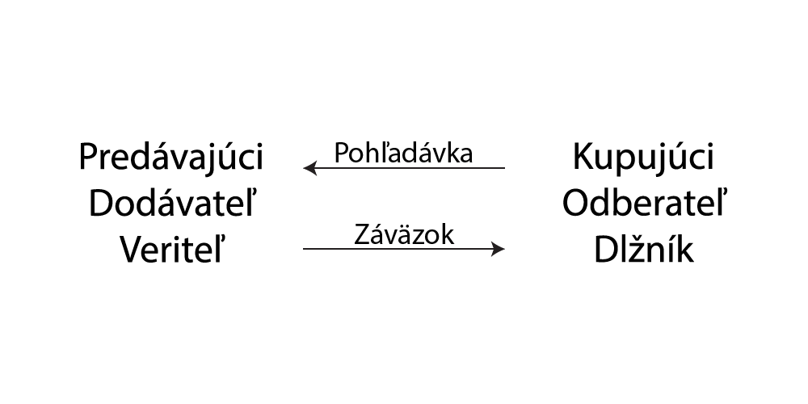
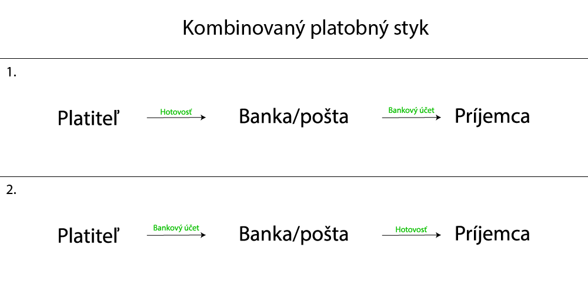
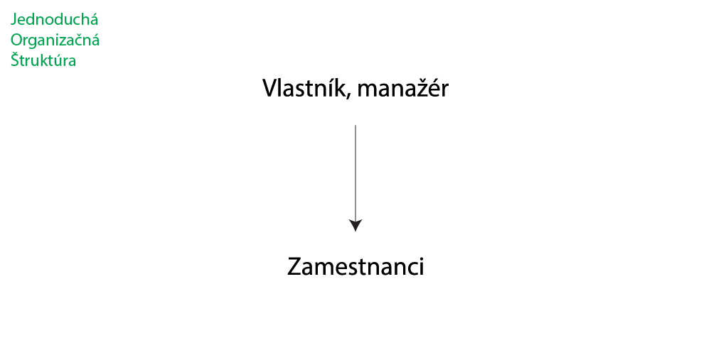
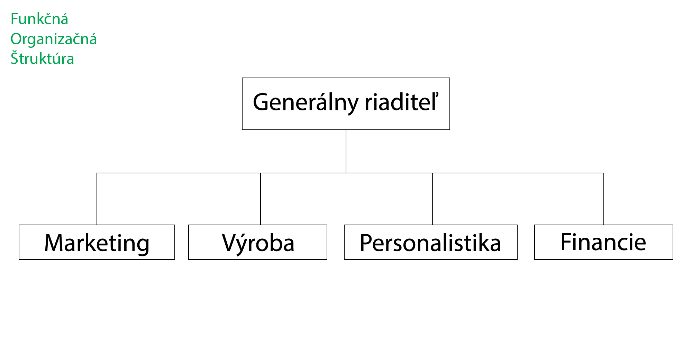
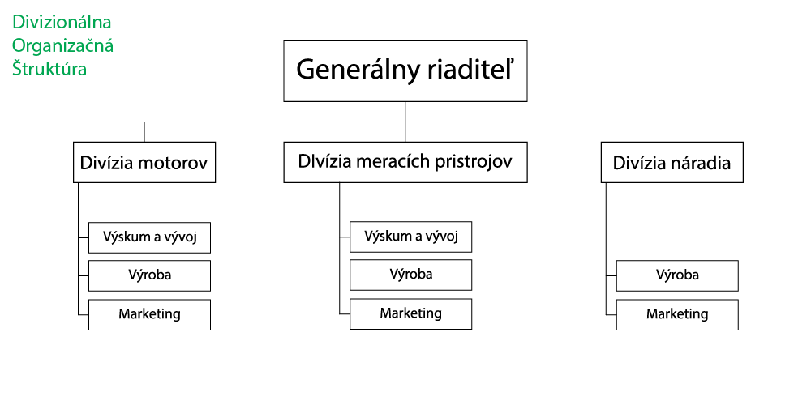
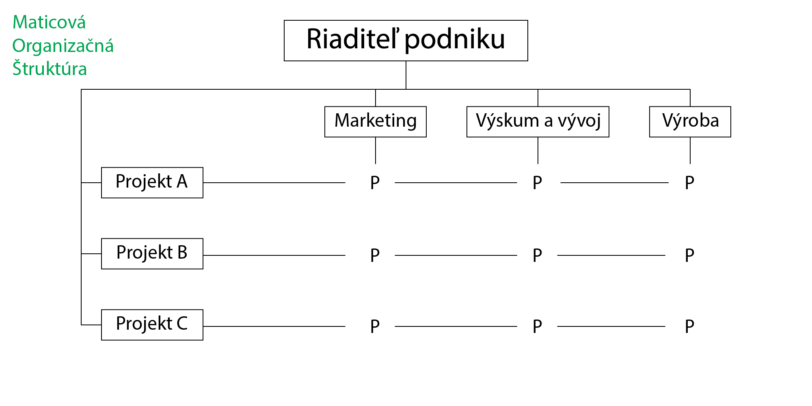

# Ekonomika - maturitné otázky  

&nbsp;  
# 1 - Dlhodobý majetok
## Charakteristika, členenie + príklady
Dlhodobý majetok slúži dlhodobo na uskutočňovanie podnikových činností. Má dobu použiteľnosti/splatnosti \> 1 rok. Nespotrebuje sa naraz, postupne sa opotrebúva jeho používaním 

Delenie:
- hmotný - pozemky, byty, samostatné hnuteľné veci a súbory nehnuteľných vecí
- nehmotný - softvér, oceniteľné práva, goodwill
- finančný - cenné papiere, podiely, pôžičky ktoré podnik poskytol
- pohľadávky - pohľadávky podniku voči iným PO/FO, ktoré majú byť v budúcnosti premenené na peniaze

## Spôsoby obstarania a oceňovania + účtovanie
Obstaranie:
- kúpou
- vlastnou činnosťou
- darovaním/bezplatným nadobudnutím
- prevodom z osobného vlastníctva do podnikania

Oceňovanie:
- obstarávacia cena (OC)- cena, za ktorú sa majetok obstaral + náklady súvisiace s jeho obstaraním
- reprodukčná obstarávacia cena (ROC) - vyjadruje zmenené reprodukčné podmienky používania majetku. Je to cena, ktorú by mal majetok mať v čase, keď sa o ňom účtuje
- vlastné náklady (VN) - súčet priamo a nepriamo vynaložených nákladov pri vlastnej výrobe majetku
- zostatková cena (ZC) - cena, ktorá nám ostane po odpísaní istej sumy z majetku
- oprávky - kumulované (sčítané) odpisy, t. j. súčet odpisov majetku za celú dobu životnosti

## Zdroje financovania
- interné (samofinancovanie) - kladný rozdiel medzi výnosmi a nákladmi
    - základné imanie
    - kapitálové fondy
    - fondy zo zisku
    - výsledok hospodárenia minulých rokov
    - výsledok hospodárenia bežného účtovného obdobia
- externé
    - vklady vlastníkov - väčšinou slúžia ako štartovný kapitál pri založení podniku
    - dotácie - nenávratný finančný zdroj, ktorý podnik získa od štátu alebo samosprávy
    - granty

## Náležitosti účtovného dokladu
- názov dokladu
- číselné označenie
- obsah účtovného prípadu
- označenie účastníkov účtovného prípadu
- peňažná suma alebo údaj o cene za mernú jednotku a vyjadrenie množstva
- dátum vyhotovenia dokladu
- dátum uskutočnenia účtovného prípadu, ak nie je zhodný s dátumom vyhotovenia (vystavenia) dokladu
- podpis osoby zodpovednej za účtovný prípad, ak overenie prípadu nie je možné zabezpečiť inak

## Cenkros  

&nbsp;  
# 2 - Opotrebenie DM
## Odpis
- nákladová položka, vyjadruje opotrebenie majetku

## Fyzické a morálne opotrebenie
- fyzické - znižovanie hodnoty majetku tým, že sa používa
    - aktívne - samostatné používanie DM
    - pasívne - fyzické starnutie v dobe nepoužívania
- morálne
    - vplyvom technického pokroku - vyrábajú sa technicky dokonalejšie výrobky
    - vplyvom restu produktivity práce - znižujú sa náklady, cena DM klesá 

## Účtovné a daňové odpisy
- Účtovné odpisy - predstavujú reálne opotrebenie majetku
- Daňové odpisy - sú stanovené zákonom

## Postup účtovania odpisov
| | | |
| :--- | :--- | :--- |
| ID | odpis DHM, DNM | *551/08x, 07x* |
| ID | zúčtovanie zostatkovej ceny DHM, DNM | *551/08x, 07x* |

## Výpočet zostatkovej ceny 
Zostatková cena = vstupná cena - oprávky  
ZC = VC - O

## Metódy odpisovania DM
- rovnomerné odpisovanie 
- zrýchlené odpisovanie

## Príčiny vyradenia + spôsob účtovania
Príčiny:
- z dôvodu nepotrebnosti stroja - predajom
- z dôvodu morálneho/fyzického opotrebenia (zastaralý, poškodený) - likvidáciou
- z dôvodu najmä morálneho opotrebenia - darovaním
- ak už nie je potrebný na účely podnikania - preradením z podnikania do osobného používania

Účtovanie:
| | Predaj DHM | |
| :--- | :--- | :--- |
| VFA | Faktúra za predaj stroja | *315/641* |
| ID | Odpis zostatkovej ceny stroja | *541/082* |
| ID | Vyradenie stroja | *082/022* |

| | Darovanie DHM | |
| :--- | :--- | :--- |
| ID | Bezodplatné odovzdanie stavby | *543/081* |
| ID | Vyradenie DHM - stavby | *081/021* |

| | Likvidácia DHM | |
| :--- | :--- | :--- |
| ID | Odpis zostatkovej ceny DHM | *551/082* |
| ID | Vyradenie DHM z majetku | *082/022* |

&nbsp;  
# 3 - Mzda
## Definícia + funkcie
Mzda = cena práce  

Funkcie:
- Národno-hospodárska - mzda je odmena za poskytnutie výrobného faktora
- Podnikovo-hospodárska - významná nákladná položka
- Stimulačná - motivácia na zvýšenie výkonu
- Sociálna - zabezpečenie sociálnej istoty, ovplyvňuje životnú úroveň

## Základné a doplnkové formy
- Základné formy 
    - Časová
    - Úkolová
    - Podielová
    - Kombinovaná (časová + úkolová)
    - Zmluvná (manažérska)
    - Naturálna
- Doplnkové formy
    - Odmeny
    - Prémie
    - Osobné ohodnotenie
    - Podiely na výsledku hospodárenia

## Spôsob výpočtu a účtovania mzdy
| | Výpočet mzdy |
|:-:|---|
| | Hrubá mzda |
| + | Plnenia zúčtovanie a vyplatené v príslušnom kalendárnom mesiaci |
| = | Hrubý príjem |
| - | Povinné poistné SP |
| - | Preddavky na ZP |
| = | Čiastkový základ dane |
| - | Nezdaniteľná časť základu dane na daňovníka |
| = | Zdaniteľná mzda/Základ dane |
| - | Preddavok na daň |
| + | Daňový bonus |
| = | Čistá mzda |
| + | Náhrada príjmu pri PN |
| - | Čisté zrážky |
| = | Čistý príjem/K výplate |

## Sociálne poistenie
Sociálne poistenie slúži na ochranu obyvateľov v rôznych situáciách (materstvo, PN). Povinnosť prispievať do sociálneho poistenia vyplýva zo zákona.

Rozdelenie:
- Nemocenské poistenie
- Dôchodkové poistenie
- Úrazové poistenie
- Garančné poistenie
- Poistenie v nezamestnanosti

## Pracovný čas - formy, doba odpočinku, dovolenka
**Pracovný čas** je časový úsek, v ktorom je zamestnanec k dispozícií zamestnávateľovi, vykonáva prácu podľa pracovnej zmluvy. Je určený podľa zmennej prevádzky:
- Ranná (6-14)
- Poobedňajšia (14-22)
- Nočná (22-6)
&nbsp;  
&nbsp;  
- 1-zmenná prevádzka - 40 hodín týždenne  
- 2-zmenná prevádzka - 38 $\frac{3}{4}$ hodín týždenne  
- 3-zmenná prevádzka - 37 $\frac{1}{2}$ hodín týždenne  

Môže byť rozvrhnutý:
- Rovnomerne - rovnaký pracovný čas počas všetkých pracovných týždňov, týždeň je rozvrhnutý na 5 pracovných dní
- Nerovnomerne - pracovný čas v jednotlivých týždňoch je rozdelený, pracovný čas za 1 deň nesmie presiahnuť 12 hodín

Najvyšší rozsah týždenného pracovného času (neobsahuje prestávky v práci):
- 40 hodín
- 30 hodín - do 16 rokov
- 37 $\frac{1}{2}$ hodín - nad 16 rokov

Pracovný čas môže byť pružný - zamestnávateľ nestanoví presný začiatok a koniec pracovného času, ale určí mu čas, ktorý musí byť na pracovisku. Pružný môže byť deň, týždeň, mesiac

**Doba odpočinku**  
- Prestávky v práci - ak zamestnanec pracuje <u>\> 6 hodín</u> (mladiství \> 4,5 hodiny) vzniká mu nárok na odpočinok a jedenie v trvaní <u>30 minút</u> po 4 odpracovaných hodinách
- Nepretržitý denný odpočinok - zamestnanec musí mať medzi zmenami odpočinok <u>min. 12 hodín</u> (mladiství min. 14 hodín)
- Nepretržitý odpočinok v týždni - zamestnanec musí mať 1 $1\times$ za týždeň <u>2 po sebe nasledujúce dni</u> nepretržitého odpočinku (sobota a nedeľa/nedeľa a pondelok) 
- Dni pracovného pokoja - štátne sviatky a ostatné sviatky

**Dovolenka** na zotavenie
- Ak zamestnanec odpracoval nepretržite <u>60 dní</u>, má nárok na dovolenku v rozsahu <u>4 týždňov</u> za kalendárny rok, ak zamestnanec dovŕši 33 rokov je to 5 týždňov, majstri odborného výcviku, učitelia 8 týždňov
- Ak pracovný pomer netrval nepretržite počas celého kalendárneho roka, zamestnanec má právo nárok na pomernú časť dovolenky - <u>každý mesiac $\frac{1}{12}$ dovolenky</u>
- Dovolenka za odpracované dni - ak zamestnanec nemá právo na dovolenku podľa bodu 1, má právo na <u> $\frac{1}{12}$ dovolenky</u> za každých odpracovaných <u>21 dní</u>
- Ak zamestnanec pracoval v sťažených podmienkach, pripočíta sa mu <u>1 týždeň</u> dovolenky

## Účtovné doklady a knihy spojené so mzdovou evidenciou
| | Účtovné doklady |
|---|---|
| VFA | Vystavená faktúra |
| PFA | Prijatá faktúra |
| ID | Interný účtovný doklad |
| VPD | Výdavkový pokladničný doklad |
| PPD | Príjmový pokladničný doklad |
| VYD | Výdajka zásob zo skladu |
| PRI | Príjemka zásob zo skladu |
| VBÚ | Výpis bankového účtu |
| ZVL | Zúčtovacia výplatná listina |

&nbsp;  
# 4 - Náklady
## Definícia + členenie + príklad
Členenie podľa objemu výroby:
- Fixné (pevné)
    - So zmenou výroby sa celkovo nemenia, ale mení sa ich podiel pripadajúci na jednotku výkonu
    - Napr. elektrická energia, voda, kúrenie, nájomné, odpisy, úroky z úverov
- Variabilné (premenlivé, pružné) - menia sa so zmenou objemu výroby
    - Proporcionálne - rastú v tom istom pomere ako objem výkonov, napr. spotreba priameho materiálu na výrobok
    - Neproporcionálne
        - Progresívne - ich celková výška rastie rýchlejšie ako objem výkonov (ak objem výkonov rastie) a klesá pomalšie ako objem výkonov (v prípade ak objem výkonov klesá). Napr. príplatky za nadčas, príplatky v dňoch pracovného pokoja, náklady na nepodarky. *Priama mzda pracovníka je 5€/hod., ak pracuje nadčas je jeho mzda 5,50€/hod. Čím viac nadčasových hodín odpracuje, tým sú celkové náklady vyššie a rastú rýchlejšie*
        - Degresívne - ich celková výška rastie pomalšie ako objem výkonov (ak objem výkonov rastie) a klesá rýchlejšie ako objem výkonov (ak objem výkonov klesá). Napr. náklady na opravy DM, náklady na pomocný materiál, technologické palivo a pod. *Podnik vlastní stroje, na ktorých sa robia každoročne opravy 100€ na 10 000 ks výrobkov -> 0,01€/ks. Ak vyrobí 15 000 ks výrobkov, stroje treba opravovať častejšie a cena opravy je 130€ -> 0,0086€/ks. Pri 20 000 ks je cena 160€ -> 0,008€/ks.*
        - Regresívne - vyvíjajú sa nepriamo úmerne s objemom výkonov. Napr. mzdy vyplatené za prestoje

## Položky kalkulačného vzorca + úloha vzorca
| | Kalkulačný vzorec |
|---:|---|
| 1. | Priamy materiál |
| 2. | Priame mzdy |
| 3. | Ostatné priame náklady |
| 4. | Výrobná (prevádzková) réžia |
| = | Vlastné náklady výroby |
| 5. | Správna réžia |
| = | Vlastné náklady výkonu |
| 6. | Odbytové náklady |
| = | Úplné vlastné náklady výkonu |
| 7. | Zisk |
| = | Cena výrobku (služby) |
| 8. | Daň z pridanej hodnoty |
| = | Predajná cena vrátane DPH |

## Výnosy + členenie z účtovného hľadiska
Výnos je zvýšenie ekonomických úžitkov účtovnej jednotky v účtovnom období, ktoré sa dá spoľahlivo oceniť.

## Zásady účtovania nákladov a výnosov
Náklady:
- Účtujú sa v triede 5
- Vždy na ľavej strane (Dal)

Výnosy:
- Účtujú sa v triede 6
- Vždy na pravej strane (Má dať)

## Ako sa z účtovníctva zistí výsledok hospodárenia + spôsob rozdelenia

&nbsp;
# 5 - Trh
## Charakteristika + subjekty trhu
Trh je miesto, kde dochádza k výmene tovarov a služieb medzi jednotlivými trhovými subjektami  

Subjekty trhu:
- Domácnosti
- Podniky
- Štát

## Čo vyjadruje dopyt, ponuka, rovnovážna cena
**Dopyt** predstavuje množstvo statku, ktoré je kupujúci ochotný a schopný **kúpiť** za danú cenu tohto statku za dané časové obdobie.  
**Ponuka** predstavuje množstvo statku, ktoré je predávajúci ochotný a schopný **predať** za danú cenu tohto tovaru za dané časové obdobie.  
**Rovnovážna cena** je, keď sa ponúkané množstvo tovaru rovná požadovanému množstvu tovaru *(dopyt = ponuka)*. Nevzniká tu ani nedostatok ani prebytok tovaru. Je to veľmi výnimočný stav.

## Význam konkurencie, typy konkurencie + príklady
Druhy konkurencie: 
- Podľa subjektov trhu
    - Konkurencia medzi dopytom a ponukou - spotrebitelia chcú kupovať za nízke ceny, výrobcovia chcú predávať za vysoké ceny
    - Konkurencia na strane dopytu - konkurencia medzi spotrebiteľmi. Cieľom každého spotrebiteľa je nakúpiť čo najviac za čo najlepšiu cenu, hoci aj na úkor ostatných. Konkurencia na strane D rastie, keď je na trhu nedostatok P a naopak
    - Konkurencia na strane ponuky - každý výrobca sa usiluje maximalizovať svoj zisk a posilniť si pozíciu na trhu aj na úkor konkurencie
- Podľa formy prejavu
    - Cenová konkurencia - výrobca znižuje ceny, na určitý čas sa vzdáva zisku - snaží sa získať spotrebiteľov
    - Necenová konkurencia - pomocou reklamy, služieb, rastom kvality a pod.
- Podľa trhových podmienok
    - Dokonalá konkurencia - ak je na trhu veľa predávajúcich aj kupujúcich, ale žiaden z nich nedokáže dosiahnuť taký veľký zisk, aby mohol ovplyvniť trhovú cenu. *(Napr. niektoré odvetvia poľnohospodárstva (pšenica, bavlna))*
    - Nedokonalá konkurencia
        - Monopolistická konkurencia *(Napr. maloobchod (potraviny), čerpadlá pohonných hmôt)*
            - Veľa malých podnikov
            - Odlišné produkty
        - Oligopol
            - Homogénny *(Napr. oceľ, hliník, letecká doprava)*
                - Málo veľkých podnikov
                - Takmer identické produkty
            - Heterogénny *(Napr. autá, PC)*
                - Málo veľkých podnikov
                - Odlišné produkty
        - Monopol/úplný monopol/čistý monopol *(Napr. elektrina, voda, plyn)*
            - Jeden veľký výrobca
            - Jednotlivý produkt bez náhrady

## Účtovanie zúčtovacích vzťahov z obchodného styku
Tzv. vystavené a prijaté faktúry - **účty 311, 321**

&nbsp;
# 6 - Podnik
## Charakteristika + zložky
Podnik je samostatná hospodárska jednotka, ktorá využívaním výrobných činiteľov vyrába výrobky alebo poskytuje služby určené na predaj  
Môžeme ho charakterizovať aj ako súhrn hmotných, nehmotných a osobných zložiek podnikania, ktoré zabezpečujú činnosť podniku

## Ekonomická samostatnosť, právna subjektivita
- **Ekonomická samostatnosť**
    - Podnik o všetkých skutočnostiach týkajúcich sa podniku rozhoduje sám
    - Štát nezasahuje priamo do činnosti podniku. Jeho úlohou je určiť pravidlá podnikania, vytvárať zákony a pravidlá v rámci ktorých sa môže uskutočňovať podnikanie
- **Právna subjektivita**
    - Právo podniku konať vo vlastnom mene, preberať na seba záväzky, niesť zodpovednosť za ich plnenie
    - Právo uzatvárať zmluvy s inými podnikmi
    - Zodpovednosť za záväzky z toho vyplývajúce
    - Podniky nadobúdajú právnu subjektivitu
        - Dňom zápisu do obchodného registra (obchodné spoločnosti, družstvá)
        - Dňom získania živnostenského oprávnenia (živnostníci)

## Práva a povinnosti podnikateľa
- **Základné povinnosti podniku**
    - Registrácia v OR - uvedený názov firmy, sídlo, predmet podnikania, identifikačné číslo
    - Odvádzanie daní štátu
    - Vedenie účtovníctva
    - Chránenie životného prostredia
    - Dodržiavať zákony
- **Základné práva podniku**
    - Rozhodovať o svojom vzniku, zlúčení, zániku, rozdelení
    - Používať obchodné meno
    - Uskutočňovať obchodné aktivity v medziach zákona
    - Nadobúdať majetok v neobmedzenom rozsahu
    - Zamestnávať zamestnancov
    - Rozhodovať o použití zisku  
&nbsp;
- **Povinnosti podnikateľov**
    - Pri kontrole musí podnikateľ inšpektorom umožniť kontrolu - umožniť vstup do objektu alebo na pozemky a do iných priestorov, ktoré súvisia s predajom tovaru či služieb. 
    - Ak kontrolovaná osoba ruší alebo inak sťažuje výkon kontroly, môže mu byť uložená poriadková pokuta.
    - V stanovej lehote sa musia odstrániť zistené nedostatky, ich príčiny a vykonať opatrenia na ich odstránenie. 
    - Musí sa o tom v stanovenej lehote podať správa inšpektorátu.
    - Ak sa zistí, že bezpečnosť alebo kvalita výrobku, nie je vyhovujúca, musia sa uhradiť náklady na skúšky
- **Práva podnikateľov** 
    - Ak kontrolovaná osoba s opatreniami nesúhlasí, môže proti nim podať do 3 dní odo dňa ich doručenia písomné námietky.
    - Ak sa udelí pokuta, je možné sa odvolať v správnom konaní do 15 dní od doručenia rozhodnutia.

## Hlavné ciele a činnosti podniku (charakteristika)
- **Ciele podniku**

- **Činnosti podniku**
    - Investičná činnosť - zabezpečenie potrebného (investičného) majetku
        - Podľa účelu ich použitia
            - Čisté - nákup nových kapitálových statkov - získanie ďalšieho DM
            - Obnovovacie - investície do už existujúcich kapitálových statkov - obnova opotrebovaného DM
        - Podľa druhu majetku získaného investíciou
            - Hmotné - náklady na obstarávanie DHM
            - Hmotné - náklady na obstarávanie DNM
            - Hmotné - investície do cenných papierov
    - Zásobovacie činnosť - proces zabezpečovania podnikového procesu potrebnými zásobami v potrebnom množstve, kvalite, čase a cene
        - Plánovanie zásob
            - Plánovanie objemu nákupu podľa druhu materiálu
                - Nákup vo veľkom množstve v dlhších časových intervaloch - nie je ohrozená plynulosť výroby, nižšie náklady
                - Nákup v malom množstve v kratších časových intervaloch - ohrozenie plynulosti, náročná organizácia zásobovania, vyššie náklady
            - Stanovenie noriem zásob podľa druhov materiálu
        - Nákup 
            - Výber najvhodnejších dodávateľov
            - Výber najvhodnejšieho spôsobu dodávok jednotlivých druhov zásob
        - Skladovanie - úlohou je zabezpečiť plynulosť výrobného procesu
            - Prijímanie nakúpených zásob do skladu
            - Uloženie zásob v sklade
            - Ošetrenie (ochrana) zásob
            - Príprava na výdaj do výroby
        - Riadenie zásob
            - Optimálne množstvo zásob:
                - Umožňuje nepretržitý výrobný proces
                - Viaže minimálne množstvo finančných prostriedkov
                - Vyžaduje minimálne náklady na skladovanie
    - Personálna činnosť podniku - zameriava sa na plánovanie, získanie, výber a zamestnávanie pracovníkov potrebných pre podnikový transformačný proces (premena výrobných vstupov na výstupy)
        - Pracovníci podľa úlohy v podnikovom transformačnom procese
            - Robotníci
                - Výrobní - zúčastňujú sa výroby výrobkov
                - Pomocní - pomocné práce (údržbár, opravár, skladník)
            - Technickí, administratívni, riadiaci - konštruktér, technológ, účtovník, asistent riaditeľa, manažér
            - Ostatní - pomocný a obslužný personál (vrátnik, upratovačka, strážnik)
    - Odbytová činnosť - najdôležitejšia (predajom sa vracajú a zhodnocujú svoje finančné prostriedky)

## Členenie podnikov
- **Podľa predmetu činnosti**
    - Výrobné podniky
        - Priemyselné podniky
            - Ťažobné (ťažba surovín a palív)
            - Spracovateľské
                - Prvotne - hutníctvo železa
                - Druhotne - strojárske
        - Stavebné podniky - sú osobitným druhom spracovateľských podnikov
            - Podniky priemyselnej výroby
            - Podniky bytovej výstavby
            - Podniky pozemných stavieb
        - Poľnohospodárske podniky - zaoberajú sa poľnohospodárskou prvovýrobou (rastlinnou a živočíšnou), ktorej výsledkom sú najmä suroviny pre potravinársky priemysel
        - Lesnícke podniky - náplňou ich činnosti je zakladanie, obnova, pestovanie a ochrana lesa, ťažba dreva, chov a ochrana zveri
    - Nevýrobné podniky - služby  
        - Dopravné podniky - zabezpečujú prepravu osôb a nákladov
            - Podniky individuálnej dopravy
            - Podniky hromadnej dopravy
            - Špeciálne druhy dopravy - potrubná
        - Podniky cestovného ruchu - ubytovacie podniky a podniky poskytujúce služby súvisiace s cestovným ruchom
        - Podniky vnútorného obchodu a verejného stravovania - predaj potravinárskeho a priemyselného tovaru, reštaurácie, kaviarne  
        - Kultúrno-vzdelávacie podniky - vzdelávacie inštitúcie, vydavateľstvá, filmové podniky
        - Finančné podniky - služby súvisiace s finančnými operáciami (banky, poisťovne, sporiteľne, zmenárne)
        - Ostatné - napr. liečebne, podniky sociálnej starostlivosti

- **Podľa sektorov**
    - Podnik primárneho sektora - podniky surovinového sektoru - ťažobný priemysel (bane), energetika (elektrárne), poľnohospodárstvo, lesníctvo (pestovanie a ťažba dreva)
    - Podnik sekundárneho sektora - podniky sektoru výroby, kam patria priemyselné podniky (strojárske, textilné, potravinárske), stavebné, remeselné (sklárstvo)
    - Podnik terciárneho sektora - podniky sektoru služieb, napr. podniky cestovného ruchu, obchodné, finančné, dopravné
    - Podnik kvarciárneho sektora - oblasť vedy, techniky, výskum, školstvo a zdravotníctvo  

- **Podľa veľkosti**
    - Malé - do 50 zamestnancov
    - Stredné - do 500 zamestnancov
    - Veľké - nad 500 zamestnancov

- **Podľa vlastníctva**
    - Štátne - majetok podniku je vlastníctvom štátu 
    - Súkromné - majetok podniku je súkromným vlastníctvom
    - Zmiešané - kombinácia oboch foriem vlastníctva, najčastejšie ide o spojenie štátneho a súkromného vlastníctva v tých oblastiach podnikania, ktoré potrebuje mať štát pod kontrolou (napr. výroba zbraní, preprava plynu)

- **Podľa právnej formy**
    - Podnik jednotlivca (živnosti) - vlastníkom podniku je jednotlivec, ktorý vkladá do podniku časť svojho majetku. Vlastník podniku sám rozhoduje o jeho činnosti a sám nesie aj celé riziko spojené s podnikaním. Ručí sa za záväzky svojej firmy neobmedzene, celým svojím majetkom (aj osobným majetkom)
    - Obchodné spoločnosti - združenie 2 alebo viacerých podnikateľov, ktoré vzniká na základe zmluvy. Spoločníci sa spoločne podieľajú na dosiahnutom zisku, ale aj prípadné straty uhrádzajú spoločne
    - Družstvá - ako spoločenstvá neohraničeného počtu osôb, založené za účelom podnikania, alebo zabezpečovania hospodárskych, sociálnych a iných potrieb svojich členov. Družstvo je PO, zapisuje sa do OR. Poznáme poľnohospodárske, spotrebné, výrobné a bytové družstvá
    - Zvláštne formy bez právnej subjektivity
        - Tiché spoločenstvo
        - Združenie osôb na spoločné podnikanie

## Cenkros

&nbsp;
# 7 - Finančné riadenie
## Finančné zdroje - charakteristika
- **Zdroje financovania**
    - Podľa účelu
        - Ako kapitál - slúžia na zriadenie, modernizáciu a rozširovanie výrobnej kapacity podniku,, na investovanie do budov, strojov a zariadení
        - Ako peniaze - slúžia na zabezpečenie krátkodobých potrieb - platobnej schopnosti a likvidity podniku
    - Podľa doby splatnosti
        - Krátkodobé - do 1 roka
        - Strednodobé - 1 až 4 roky
        - Dlhodobé - viac ako 4 roky
    - Podľa vlastníctva
        - Vlastné - vklad majiteľa, zdroje získavania z podnikateľskej činnosti, zisk, odpisy a zdroje získané z nepeňažných zložiek majetku podniku (predaj nepotrebných strojov, zásob a pod.), nenávratné dotácie, pohľadávky, atď. Z hľadiska doby splatnosti sú to trvalé zdroje s neobmedzenou splatnosťou
        - Cudzie - všetky druhy úverov, pôžičiek, finančný lízing, záväzky (zamestnanci, štátny rozpočet)
    - Podľa zdroja, z ktorého plynú do podniku
        - Interné finančné zdroje - vznikajú v podniku vlastnou podnikateľskou činnosťou
            - Zisk = samofinancovanie
            - Odpisy
            - Fondy
            - Ostatné (predaj nepotrebného majetku)
        - Externé finančné zdroje - podnik ich získava zo svojho okolia
            - Vklady vlastníkov
            - Úvery
            - Dotácie, granty
            - Osobitné formy financovania
                - Lízing
                - Faktoring
                - Forfeiting
## Úloha finančného riadenia
Stanovenie finančných cieľov a spôsoby ich dosiahnutia. Uskutočňujú ho finanční manažéri s vhodnou klasifikáciou a skúsenosťou  

- Základný finančný cieľ - maximalizácie trhovej hodnoty podniku pre vlastníkov, t.j. reálnej hodnoty (suma, za ktorú sa podnik môže predať)
- Čiastkové finančné ciele
    - Likvidita - schopnosť podniku uhrádzať záväzky
    - Rentabilita - schopnosť dosahovať zisk
    - Stabilita - schopnosť udržať a zvyšovať svoju trhovú hodnotu pri meniacich sa podmienkach trhu

Finančný plán - nástroj finančného riadenia, <u>písomný dokument</u>, ktorý obsahuje plánované finančné ciele podniku, postupy a spôsoby ich dosahovania

- Úlohy finančného plánu
    - Analýza finančných zdrojov - určiť potrebu kapitálovej štruktúry, t.j. aké množstvo finančných zdrojov má k dispozícií
    - Analýza investičných príležitostí - do akých aktív alokuje svoje finančné zdroje
    - Prognózovanie budúcich príležitostí - predvídanie budúcich výsledkov na základe súčasných rozhodnutí (vytvorenie FP v niekoľkých variantoch)
    - Výber najvhodnejšieho variantu - vyhovuje súčasnému stavu so zreteľom na prognózovanie budúceho obdobia
- Kritériá, ktoré by mal FP spĺňať
    - Ciele podniku - identifikácia strategických a čiastkových cieľov, ktoré vyplývajú z výsledkov finančnej analýzy podniku
    - Základné stratégie - spôsoby, akými sa uskutočňujú stanovené ciele podniku
    - Krátkodobý finančný plá a rozpočty - rozpočty analyzujú finančné údaje o príjmoch výdavkoch podrobnejšie
    - Finančná bilancia - jej úlohou je poskytnúť prehľad o finančnej a majetkovej štruktúre podniku
- Postup tvorby a realizácie finančného plánu
    1. Finančná analýza podniku
    2. Formulácie cieľov - strategické a čiastkové
    3. Základná stratégia - závisí od cieľov
    4. DLhodobý finančný plán - dôležitá prognóza vývoja trhu a faktorov
    5. Krátkodobý finančný plán a rozpočty - plánovanie príjmov a výdavkov
    6. Implementácia (realizácia) finančného plánu
    7. Kontrola a korekcia finančného plánu - priebežne + úpravy
- Členenie finančných plánov
    - Krátkodobé - plánovanie na obdobie niekoľko mesiacov až 1 rok. Jeho úlohou je:
        - Konkretizovať potrebu kapitálu v danom roku a zdroje jeho získania
        - Zabezpečiť trvalú platobnú schopnosť podniku
        - Odhaliť možnosť a príčiny vzniku platobnej neschopnosti
        - Riadiť peňažný tok do a z podniku, aby bol podnik schopný v každom okamihu uhrádzať svoje záväzky
    - Dlhodobé - plánovanie na viac ako 1 rok. Jeho úlohou je:
        - Zabezpečenie vhodnej štruktúry finančných zdrojov
        - Alokácia finančných zdrojov do jednotlivých zložiek majetku
## Cash-flow
Cash-flow (alebo saldo) je výsledkom plánu peňažných príjmov a výdavkov (základná forma krátkodobého FP), ktorý vyjadruje sumu peňažných prostriedkov, ktoré podnik mesačne získa alebo zaplatí  
- **Cash-flow môže byť:**
    - vyrovnaný - príjmy = výdavky
    - kladný    - príjmy > výdavky
    - záporný   - príjmy < výdavky
## Investície + členenie
<u>Investovanie</u> je činnosť, prostredníctvom ktorej podnik umiestňuje finančné zdroje do rôznych zložiek majetku  
<u>Investície</u> sú výdavky vynaložené na získanie konkrétnych aktív  
<u>Deinvestovanie</u> je znižovanie objemu majetku podniku  

- **Členenie investícií**
    - Z hľadiska druhu (aktív)
        - Hmotné, ktorých výsledkom je DHM (pozemky, budovy, stroje a zariadenia) a zásoby
        - Nehmotné, ktorých výsledkom je DNM (licencie, patenty, know-how)
        - Finančné - investovanie do finančného majetku (umelecké zbierky, dlhodobé a krátkodobé cenné papiere)
    - Z hľadiska obratu majetku podniku a viazanosti kapitálu
        - Investície do stálych aktív - na obstaranie DM (pozemky, budovy, stroje)
        - Investície do obežných aktív - na obstaranie KM (zásob, pohľadávok a KFM)
    - Z časového hľadiska 
        - Dlhodobé - výnos sa očakáva za viac ako 1 rok. Investičné riziko je vyššie
        - Krátkodobé - výnos sa očakáva spravidla do 1 roka. Nazývame ich bežné prevádzkové výdavky. Investičné riziko je nižšie
## Úloha finančnej analýzy + zdroje financovania
Jej úlohou je určiť potrebu kapitálovej štruktúry, t.j. aké množstvo finančných prostriedkov je má k dispozícií
> Tento odsek sa už nachádza pri [úlohe finančného riadenia](#úloha-finančného-riadenia)
## Činitele, ktoré ovplyvňujú finančnú situáciu podniku
## Koho zaujíma finančná situácia, prečo

&nbsp;
# 8 - Činnosti personálneho útvaru (zdroje získavania, metódy výberu)
## Zamestnanec, zamestnávateľ + povinnosti
**Zamestnanec** - FO, ktorá v pracovnoprávnych vzťahoch vykonáva pre zamestnávateľa závislú prácu podľa jeho pokynov za mzdu alebo odmenu. Spôsobilosť mať práva a povinnosti ako zamestnanec vzniká dňom, keď dovŕši 15 rokov života  
**Zamestnávateľ** - PO alebo FO, ktorá zamestnáva aspoň 1 FO v pracovnoprávnom vzťahu
## Druhy pracovného pomeru  
- Na dobu určitú - stanoví sa časové obdobie, počas ktorého bude trvať pracovnoprávny vzťah. Toto obdobie je 1 rok + možnosť predĺžiť na ďalší rok alebo 2 roky vkuse Uplynutím tejto doby sa pracovný pomer končí
- Na dobu neurčitú - nie je stanovené obdobie, počas ktorého bude trvať pracovnoprávny vzťah
- Dohodou
## Spôsob vzniku a ukončenia pracovného pomeru
- **Vznik pracovného pomeru**
    - Voľbou - používa sa vo verejnej správe (voľba prezidenta, poslancov, primátorov)
    - Vymenovaním - vo verejnej správe (vymenovaním ústredných orgánom vedúcich pracovníkov, rektorov vysokých škôl)
    - Pracovnou zmluvou - zakladá sa ňou pracovný pomer v súkromnom aj verejnom sektore
- **Ukončenie pracovného pomeru**
    - Dohodou - musí sa vypracovať písomne, obe strany dostanú 1 kópiu. Pracovný pomer sa končí sa dohodnutým dňom
    - Výpoveďou - zo strany zamestnanca alebo zamestnávateľa
        - Zamestnávateľ môže dať výpoveď iba v prípadoch, ktoré uvádza Zákonník práce
        - Zamestnanec môže dať výpoveď kedykoľvek, aj bez udania dôvodu
        - Výpoveď je platná, ak je písomne a doručená osobne alebo poštou. Pracovný pomer sa končí uplynutím výpovednej lehoty alebo vyplatením odstupného
## Náležitosti pracovnej zmluvy
- **Podstatné náležitosti**
    - Druh práce
    - Miesto výkonu práce
    - Deň nástupu do práce
    - Mzdové podmienky (uvádza sa hrubý príjem)
- **Vedľajšie náležitosti**
    - Skúšobná doba
    - Pracovné podmienky
    - Výplatné termíny
    - Výmera dovolenky
    - Dĺžka výpovednej lehoty
## Postup účtovania pohľadávok a záväzkov voči zamestnancom  
Používajú sa 2 účty 
- *333 - Ostatné záväzky voči zamestnancom*
- *335 - Pohľadávky voči zamestnancom*
> Účet *331 - Zamestnanci* sa používa iba pri prípadoch spojených so mzdou, napr. Priznané hrubé mzdy *512/331*

| | |
|---|---|
| Záväzky - pribúdanie | *xxx/333* |
| Záväzky - ubúdanie | *333/xxx* |
| Pohľadávky - pribúdanie | *335/xxx* |
| Pohľadávky - ubúdanie | *xxx/335* |
## Nezamestnanosť
Nezamestnanosť je sociálno - ekonomický jav, ktorý vyjadruje neúplné využitie práceschopného obyvateľstva, ktoré má záujem pracovať
- **Príčiny**
    - Strata zamestnania
    - Nemožnosť návratu do zamestnania (predĺžená materská dovolenka)
    - Dobrovoľné zanechanie zamestnania (tzv. dobrovoľná nezamestnanosť)
    - Nemožnosť nájsť si primeranú prácu
    - Zmena bydliska
    - Nezáujem nájsť si prácu a začať znova pracovať
- **Formy**
    - Dobrovoľná (prirodzená) - počet nezamestnaných $\le$ pracovné miesta
    - Nedobrovoľná - počet pracovných síl je absolútne väčší ako počet voľných pracovných miest
    - Frikčná spojená s určitými prirodzenými životnými cyklami, napr. po skončení štúdia, materskej dovolenky sa hľadá nové zamestnanie
    - Štruktúrna - vzniká vtedy, keď existuje nesúlad medzi ponukou pracovníkov a dopytom po nich. Nezamestnanosť určitej skupiny pracovných síl na jednu stranu sprevádza nedostatok pracovných síl v inej skupine, napr. profesiovej, kvalifikačnej a pod.
    - Cyklická - celkový dopyt po zamestnancoch je nízky
    - Sezónna - súvisí s výkonom sezónnych prác, keď sa nezamestnanosť v určitom období zvyšuje alebo znižuje (práce v poľnohospodárstve, stavebníctve a pod.)
    - Regionálna - je to obdoba štruktúrnej nezamestnanosti s tým, že protipól voľných pracovných síl sa nachádza v inom regióne (oblasti)
    - Krátkodobá - súvisí s posudzovaním miery nezamestnanosti, jej trvanie je do 1 roka
    - Dlhodobá - podobne ako krátkodobá, trvá viac ako 1 rok, považuje sa za sociálny problém krajiny

<u>Nezamestnaný</u> - človek schopný a ochotný pracovať, ktorý hľadá prácu z dôvodu jej straty. Je evidovaný na úrade práce (aktívne hľadanie práce)  
<u>Zamestnaný</u> - človek, ktorý vykonáva akúkoľvek platenú prácu (sú v pracovnom pomere). Ten, kto momentálne nepracuje pre chorobu, štrajk, dovolenku, zlé počasie a pod.  
<u>Ostatný</u> - obyvateľstvo mimo pracovnej sily - študenti, dôchodcovia a pod.  

<u>Miera nezamestnanosti</u> - ukazovateľ, ktorým možno vyčísliť nezamestnanosť: $miera\ nezamestnanosti = \frac{nezamestnaní}{pracovné\ sily}$

&nbsp;
# 9 - Odbytová logistika marketingu
## Formy a metódy prieskumu trhu
Prieskum trhu znamená zber, zhromažďovanie, analýzu a vyhodnocovanie informácií týkajúcich sa trhovej situácie  

Člení sa podľa:
- Objektu (predmetu) skúmania
    - Hospodársky prieskum
        - Zameriava sa na zistenie objektívnych veličín trhu, ktoré sú kvantifikovateľné
        - Patria sem napr.:
            - Obrat (objem predaja)
            - Cena tovaru
            - Tržba
            - Zisk
            - Počty a štruktúra kupujúcich a predávajúcich
    - Sociologický prieskum
        - Sleduje osoby na trhu a ich správanie
        - Zameriava sa na vonkajšie charakteristiky osôb:
            - Pohlavie
            - Vek
            - Povolanie
            - Príjem
        - Zameriava sa na pocity
            - Predstavy
            - Názory
            - Motívy
- Časového hľadiska
    - Analýza trhu
        - Získavanie údajov o momentálnej situácií na trhu (k určitému časovému okamihu)
        - Možno hovoriť o statickom prieskume trhu
    - Sledovanie trhu
        - Permanentné sledovanie zmeny trhových situácií
        - Ide o dynamický prieskum trhu
- Metód (postupu) získavania informácii
    - Primárny prieskum
        - Získavanie informácií priamo na trhu
        - Získavajú sa nové informácie, ktoré doteraz neboli k dispozícií
        - Nazýva sa prieskum v teréne - osobne, telefonicky, poštou, online
        - Základným nástrojom je dotazník
    - Sekundárny prieskum
        - Orientuje sa na spracovanie dostupných informácií na trhu
        - Môže ísť o vyhodnotenie evidenčných (štatistických) údajov sledovaných
            - Vo vlastnom podniku
                - Vnútorné informácie
                - Napr.:
                    - Údaje o odbyte, nákladoch, reklame
                    - Výročné správy, katalógy firmy
            - Mimo podniku
                - Vonkajšie informácie (externé)
                - Hovorí sa o prieskume od písacieho stola
                - Napr.:
                    - Oficiálne štatistiky, publikácie, správy

## Kontraktačná politika, metódy tvorby cien
**Kontraktačná politika** je činnosť, ktorá sa zaoberá obchodnými podmienkami pri predaji výrobkov  
- **Metódy tvorby ceny**
    - Podľa nákladov - cena výrobku sa odvíja od výšky nákladov na jeho výrobu a činností spojených s výrobou. Náklady určujú <u>dolnú hranicu</u> ceny. Podnik má 3 možnosti:
        - Cena < náklady - ak chce prežiť na trhu, pritiahnuť zákazníkov a odlákať ich od konkurencie
        - Cena = náklady - podnik nedosahuje ani zisk, ani stratu (dôvody ako pri prvom bode) 
        - Cena > náklady - podnik dosahuje zisk. Označuje sa ako tzv. prirážková metóda - náklady + prirážka na zisk (ako % nákladov)
    - Podľa dopytu - podnik určuje cenu podľa správania spotrebiteľov na trhu. Musíme poznať veľkosť dopytu a elasticitu dopytu (citlivosť dopytu na zmenu ceny)
        - E = 1 - jednotková elasticita dopytu - dopyt sa zvýši o rovnaké % ako sa zníži cena a naopak
        - E > 1 - elastický dopyt - dopyt citlivo reaguje na zmenu ceny
        - E < 1 - neelastický dopyt - dopyt reaguje na zmeny nižšou mierou
    - Podľa konkurencie - podnik stanovuje cenu podľa podobných výrobkov. Predstavujú <u>hornú hranicu</u> ceny
        - Ak podnik ponúka menej kvalitné výrobky, mal by stanoviť nižšiu cenu ako konkurencia
        - Ak podnik ponúka rovnako kvalitné výrobky, mal by stanoviť približne rovnakú cenu ako konkurencia
        - Ak podnik ponúka viac kvalitné výrobky, mal by stanoviť vyššiu cenu ako konkurencia
        
## Podstata elasticity dopytu, jej využitie v cenovej politike
Elasticita dopytu je citlivosť dopytu na zmenu ceny
> Podrobnejšie v predchádzajúcej odrážke
## Ďalšie obchodné podmienky  
- Rabat - zľava poskytnutá z ceny výrobku
    - Množstvový - pri nákupe pri stanovenom množstve
    - Vernostný - stálym zákazníkom
    - Časový - trvá iba určitý čas
        - Uvádzací
        - Sezónny
        - Veľtrhový
    - Funkčný - pre sprostredkovateľov, predajcov
    - Naturálny - pri kúpe väčšieho množstva určité množstvo zadarmo
- Dodacie podmienky - využívajú sa ako výhoda proti konkurencií
    - Spôsob doručenia
    - Právo na výmenu tovaru
    - Prispôsobovanie množstva podľa požiadaviek zákazníka
- Platobné podmienky - väčšinou sa spájajú s dodacími
    - Skonto - dohodnuté zľavy za rýchlu platbu
    - Zľavy za oneskorenie dodávky
    - Možnosť platby elektronickou formou
    - Možnosť platiť v splátkach
- Financovanie odbytu - tzv. úverová politika
    - Dodávateľský úver - napr. odloženie platby o 14 dní (faktúra)
    - Faktoring - predaj krátkodobej pohľadávky faktoringovej spoločnosti pred lehotou jej splatnosti
    - Leasing - prenájom veci s možnosťou jej odkúpenia, po určitom čase na splátky za vyššiu sumu
## Postup účtovania kúpy a predaja tovaru
| | | |
|-|-|-|
| PFA | Nákup tovaru | *131 + 343/321* |
| PFA | Preprava tovaru | *131 + 343/321* |
| ID | Zaradenie do užívania v OC | *132/131* |
| VFA | Predaj tovaru | *311*/*343 + 604* |
| ID | Úbytok predaného tovaru | *504/132* |

&nbsp;
# 10 - Marketing
## Výrobková politika - stránky  
Pod pojmom výrobková politika rozumieme činnosti spojené s právom s výrobkom
- **Kvalitatívna stránka** - sleduje užitočnosť výrobku
    - Základný úžitok - uspokojenie potreby, pre ktorú sa výrobok vyrobil
    - Vedľajšie úžitky
        - Kvalita - schopnosť produktu plniť svoje funkcie
        - Vyhotovenie - odlišnosť produktov ich vybavením alebo inými vlastnosťami (vlastný produkt od konkurenčného). Predstavuje zákazníkmi požadované varianty produktu
        - Dizajn - stvárnenie estetických vlastností produktu s dodržaním jeho funkčnosti
            - Štýl - charakterizuje výzor (vzhľad) výrobku
            - Imidž - nehmotný parameter tovaru, ktorého prostredníctvom vyvoláva v spoločnosti určitý obdiv a uznanie. Vytvára ho značná, resp. ochranná známka, ktorá odlišuje výrobky od rôznych výrobcov
        - Značka - spôsob identifikácie výrobku výrobcu a odlíšenie od konkurencie. Značkou môže byť meno, názov, znak, symbol, tvar alebo ich kombinácia. Obchodná značka chráni práva predávajúceho. Po zápise do OR je chránená pred kopírovaním ochrannou známkou
        - Balenie
            - Spotrebiteľské obaly - vnútorný obal, napr. fľaša
            - Obchodné obaly - napr. kartóny
            - Prepravné obaly - napr. palety, kontajnery
        - Služby - rozšírenie produktu o služby, servis, záruky a pod.
- **Kvantitatívna stránka**
    - Frekvencia potrieb po určitom produkte
    - Intenzita potrieb - ako často človek uspokojuje istú potrebu
        - Periodické - bežné potreby - je potreba ich uspokojovať pravidelne (viackrát ročne), napr. hlad, smäd, únava
        - Aperiodické - vyskytujú sa s veľkým časovým odstupom (ani nie každý rok), napr. kúpa auta, chladničky, TV
        - Jednorazové / singulárne potreby - vyskytujú sa iba výnimočne, bez akejkoľvek pravidelnosti, napr. potreba životného partnera, svadba
- **Práca s výrobkom**
    - Inovácia výrobku - vývoj nových výrobkov s novými úžitkovými vlastnosťami a dizajnom
    - Tvorba sortimentu
        - Diferenciácia výrobkov - prehlbovanie sortimentu, 1 druh sa vyrába v niekoľkých variáciách
        - Diverzifikácia výrobkov - rozširovanie sortimentu, podnik ponúka viac druhov výrobkov
        - Obmena výrobkov - podnik neponúka celý svoj sortiment naraz, ale v rôznych časových intervaloch ich obmieňa - sezónny tovar
        - Vyraďovanie výrobkov - výrobok je starý, neujal sa, poruchovosť celej série, zámerné zúženie sortimentu
    - Služby zákazníkom
        - Technické služby - montáž, inštalácia, servis, opravárenské služby
        - Obchodné služby - dodávka domov, poradenstvo, platba na splátky

## Životný cyklus výrobkov
1. Uvedenie na trh
    - Dopyt je nízky, obrat malý, 
    - Podnik má stratu
    - Vysoké náklady (distribúcia, propagácia)
    - Končí sa dosiahnutím prahu zisku
2. Fáza rastu
    - Rastie dopyt a tržby
    - Zvyšuje sa zisk
    - Klesajú náklady
3. Fáza zrelosti
    - Dopyt je najvyšší
    - Zisk je najvyšší
    - Tempo rastu sa postupne spomaľuje
    - Zhoršuje sa efektívnosť predaja
4. Fáza nasýtenosti
    - Cenová konkurencia spôsobuje výrazné znižovanie ziskov
    - Dopyt klesá
    - Obrat klesá
5. Fáza útlmu
    - Predaj a výroba sa stáva stratovou
    - Poskytovanie akcie, zľavy
## Činnosti spojené s prácou s výrobkom
## Nástroje komunikačnej politiky
- Reklama - Cieľavedomé komunikačné pôsobenie na potenciálnych zákazníkov so zameraním na sprostredkovanie informácie, vyvolanie predstavy, dojmu
- Podpora predaja - súbor krátkodobých stimulov, ktoré stimulujú k rýchlejšej alebo silnejšej odozve trhu. Zameriava sa na produkt
- Public relations - vytvorenie pozitívneho imidžu firmy. Zameriava sa na podnik ako celok
- Osobný predaj - personálna komunikácia s trhom, pri ktorej vzniká interakcia medzi predávajúcim a kupujúcim
## Znaky a funkcie reklamy
- **Znaky reklamy**
    - Kreativita - reklama má skrývať určitú myšlienku, používajú sa symboly, grafika
    - Účinnosť - dobrá reklama dokáže spotrebiteľa zaujať
    - Pravdivosť - má vyzdvihovať výhody produktu, nemala vy zveličovať a zámerne klamať
    - Etika - nemá porušovať základné ľudské práva, diskriminovať
- **Funkcie reklamy**
    - Komunikačná - sprostredkovanie informácie
    - Ekonomická - podporovať predaj, aktivizovať dopyt
## Druhy reklamných prostriedkov
- Tlačové - inzeráty, články v časopisoch a novinách
- Tlačené - letáky, plagáty, prospekty, vývesky, nálepky, obaly, katalógy
- Zvukové - vysielanie v rozhlase
- Audiovizuálne - TV, kinofilmy, internet
- Svetelné - neóny, svetelné nápisy
## Účtovanie vlastných výrobkov  
*612, 613, prírastky, úbytky, predaj*

&nbsp;
# 11 - Krátkodobý majetok
Je to majetok, ktorý firma používa menej ako 1 rok  
Má krátkodobý charakter  
Spotrebúva sa naraz (materiál) alebo krátkodobo (náradie)

Delíme ho na:
- Zásoby
    - Materiál
    - Nedokončená výroba
    - Polotovary vlastnej výroby
    - Výrobky
    - Zvieratá
    - Tovar
- Krátkodobý finančný majetok
    - Doba splatnosti menej ako 1 rok
    - Najlikvidnejší majetok
    - Zaraďujeme sem
        - Peniaze v hotovosti
        - [Ceniny](#ceniny)
        - Peniaze uložené na účtoch a v bankách - bežný účet, vkladový účet, devízový účet
        - Majetkové a dlhové cenné papiere s dobou splatnosti menej ako 1 rok
- Krátkodobé pohľadávky
    - Pohľadávky s dohodnutou dobou splatnosti najviac 1 rok

## Obežný majetok
Sú to zložky majetku, ktoré sa v podniku používajú krátkodobo  

Delia sa na:
- Zásoby
- Krátkodobý finančný majetok
- Krátkodobé pohľadávky

## Ceniny
Sú to ekvivalenty peňažnej hotovosti  

Môžu to byť napríklad:
- Poštové známky
- Kolky
- Šeky
- Poukážky
- Stravné lístky
- Telefónne karty
- Odberné poukážky na benzín

## Dodacie podmienky pre voľbu dodávateľa 
> Ak som pochopil správne, tak sa učivo už nachádza v otázke 9 -> [ďalšie obchodné podmienky](#ďalšie-obchodné-podmienky)

## Druhy zásob + charakteristika
Zásoby sú hmotné statky, ktoré sa nachádzajú v podniku a doteraz sa nevyužili na určený cieľ  
V podnikovom transformačnom procese pôsobia krátkodobo, menia často svoju formu, obiehajú  
Nazývajú sa obežným majetkom  

Druhy zásob:
- Podľa spôsobu obstarania
    - Nakupované zásoby
        - Výrobkové materiály - stávajú sa súčasťou výrobku
            - Základný materiál - tvorí hmotnú podstatu výrobku
            - Pomocný materiál - dotvára výrobok (lak, farba)
        - Technologický materiál a náhradné diely - stroje, oleje, mazadlá
        - Nakupovaný tovar
        - Zvieratá
    - Zásoby vlastnej výroby
        - Nedokončené výrobky - výrobky v rôznom štádiu rozpracovania
        - Polovýrobky 
            - Pre určitú časť výroby sú už hotovým výrobkom
            - Podnik ich používa v ďalšej fáze výroby na dokončenie výrobkov
        - Výrobky - konečný výsledok výroby
        - Tovar v predajniach - výrobky odovzdané do vlastnej predajne výrobkov
        - Zvieratá - prírastky chovov

## Norma spotreby materiálu
Je to maximálne množstvo, ktoré sa môže spotrebovať na jednotku produkcie v stanovenej kvalite  
> vyjadruje sa v natur. *(?)* a hodnote jednotky (€)

Rozlišujeme:
- Normu spotreby základného materiálu
    - Určí sa jednotka výkonu *(ks, m, l)*
    - Napr. drevo na drevenú stoličku
- Norma spotreby pomocného materiálu
    - Určuje sa na rôzne jednotky spotreby, pretože sa nie vždy dá určiť na jednotku výkonu
    - Pomocný materiál, ktorý sa pridáva k základnému materiálu, ale netvorí obsah hotového výrobku (laky, farby - určí sa na vyrábaný výrobok)
    - Pomocný materiál použitý pri obsluhe výrobného zariadenia (mazacie oleje určí sa na stroj, jednotka práce 100 normohodín)
    - Pomocný materiál, ktorý používa pracovná sila (odev, obuv - určí sa na robotníka, počet pracovných dní, ...)

Skladá sa z dvoch častí:
- Čistý (užitočný) podiel materiálu - materiál, ktorý vchádza do výrobku 
    - Vstupný materiál 
    - Polovýrobky
- Odpad - podnik ho môže likvidovať alebo použiť na ďalšiu výrobu
    - Technologický - vyplýva z technologického procesu, pri výrobe
    - Ostatný - vzniká pri organizácií práce - nepodarky, zmätky

Metódy určenia noriem spotreby:
- Prepočtovo - analytická
    - Vychádza z technickej a technologickej dokumentácie (norma nástrojov a výrobné postupy)
- Skúšobno - technologická
    - Norma sa stanoví skúškami vo výrobnej prevádzke alebo v laboratóriu
- Štatistická
    - Vychádza z priemernej štatistiky (skutočnej) spotreby za uplynulé obdobie

## Spôsob obstarania a ocenenia zásob
### Obstaranie
- Náhodné obstarávania
    - Podnik objednáva zásoby až vtedy, keď sa minú
    - Využíva sa najmä pri remeslách
- Obstarávanie do zásoby
    - V pravidelných časových intervaloch
    - Využíva sa hlavne v priemysle
- Bezskladové obstaranie
    - Tiež nazývané *"Just in time"* alebo *synchrónne obstarávanie*
    - Podnik dáva zásoby priamo do výroby
    - Vo väčšej miere v obchodnej činnosti

### Ocenenie
Zásady oceňovania zásob
- Nakúpené zásoby sa oceňujú v obstarávacej cene
- Zásoby vlastnej výroby sa oceňujú vo vnútroorganizačnej cene  
Táto cena vychádza z predbežnej kalkulácie vlastných nákladov výroby (spotreba materiálu, priame mzdy, ...)
- Darované zásoby a dodatočne zistené zásoby sa oceňujú reprodukčnou obstarávacou cenou = cenou, za ktorú by sa zásoby obstarali v čase, keď ju potrebujeme zistiť

## Cenkros

&nbsp;
# 12 - Distribučná politika, skladovanie
## Distribučná politika
Distribučná politika zahŕňa činnosti zameriavajúce sa na hľadanie vhodných distribučných ciest  
Cieľom je riadiť pohyb tovaru od výrobcu ku konečnému spotrebiteľovi  
## Priame a nepriame odbytové cesty
### Priame odbytové cesty
Nastáva pri nich bezprostredný kontakt výrobcu so zákazníkom  
*Výrobca -> spotrebiteľ*

Takto sa predávajú najmä:
- Výrobky neštandardného vyhotovenia
- Jednoúčelové stroje
- Kusové výrobky
- Výrobky sériovej alebo hromadnej výroby, ktoré sa dostávajú vo väčších množstvách malému počtu odberateľov
- Výrobky, ktoré umožňujú skrátiť čas potrebný na prepravu

### Nepriame odbytové cesty
Nenastáva pri nich bezprostredný kontakt výrobcu so zákazníkom  
Výrobcovia predávajú skrz sprostredkovateľov  

Poznáme 3 rôzne úrovne:
1. *Výrobca -> maloobchod -> spotrebiteľ*
2. *Výrobca -> veľkoobchod -> maloobchod -> spotrebiteľ*
3. *Výrobca -> agent -> veľkoobchod -> maloobchod -> spotrebiteľ*

Takto sa predávajú najmä:
- Výrobky, ktoré sú určené pre väčší počet odberateľov, často územne rozptýlených
- Štandardné výrobky, ku ktorým odberateľovi netreba poskytovať poradenskú službu
- Výrobky, pri ktorých netreba priamy kontakt medzi výrobcom a spotrebiteľom
- Dodávky výrobkov sériovej a hromadnej výroby

## Hlavné úlohy maloobchodu a veľkoobchodu
### Maloobchod 
Maloobchod nakupuje od veľkoobchodu a predáva konečnému spotrebiteľovi  

Jeho úlohou je:
- Vytvárať zásoby
- Pretvoriť výrobný sortiment na obchodný - predávať v malých množstvách
- Predávať produkty
- Aktívne prispievať k ochrane spotrebiteľa

### Veľkoobchod
Veľkoobchod nakupuje od výrobcu/iného veľkoobchodu a predáva maloobchodu/inému veľkoobchodu

Jeho úlohou je:
- Nákup a predaj sortimentu - zostavuje sortiment podľa potrieb zákazníkov
- Transformácia množstva - veľké zásielky delí na menšie množstvá
- Skladovanie
- Doprava dodávok a tovaru
- Financovanie - poskytovanie úverov zákazníkom
- Prevzatie rizika na seba
- Podávanie info o trhu (konkurencia)
- Služby a poradenský manažment (školenia)

## Faktory ovplyvňujúce spôsob prepravy tovaru
Podnik pri voľbe distribučného kanála rozhoduje na základe týchto kritérií:
- Rýchlosť, akou sa výrobok dostane k spotrebiteľovi (zákazníkovi)
- Skladovacia kapacita
- Distribučné náklady

Výber prepravy tovaru závisí od:
- Hospodárnosti
- Špecifických vlastností tovaru
    - Veľkosť a hmotnosť tovaru
    - Či sa jedná o tovar nebezpečný na prepravu
    - Či sa jedná o živý tovar (zvieratá)
    - Skupenstvo tovaru
    - Vzdialenosť prepravy
- Množstvo tovaru

Príklady spôsobu dopravy: automobilová, železničná, lodná, letecká, potrubná, lanovková, ...  
Jednotlivé prepravy sa odlišujú výškou nákladov a časom

Podnik môže použiť
- Vlastné dopravné prostriedky
- Cudzie dopravné prostriedky - služby dopravcov

## Doklady a činnosti spojené s príjmom a výdajom + postup účtovania
### Príjem
| | | |
|-|-|-|
| 1. PFA | Obstaranie materiálu + náklady spojené s obstaraním | *111+343/321* |
| **2. PRI** | Príjem tovaru na sklad v OC *(suma "a" - bez dph)* | *112/111* |

Doklady: PRI = príjemka

### Výdaj
| | | |
|-|-|-|
| **VYD** | Úbytok predaného tovaru | *504/132* |

Doklady: VYD = výdajka

## Úlohy zásobovacích skladov 
1. Preklenovacia - sklad umožňuje prekovať rozdiel medzi dodávkou a potrebou materiálu
2. Transformačná - niektoré zásoby získavajú skladovaním nové užitkové vlastnosti (sušenie dreva)
3. Zabezpečovacia - sklad umožňuje zásobovanie materiálom aj v prípade neočakávaných výpadkov v dodávkach

## Druhy skladov a ich využitie
- Podľa podnikových činností
    - Zásobovacie sklady 
        - Materiál
        - Skladujú sa tu zásoby priamo po prijatí, resp. dodaní
    - Výrobné sklady 
        - Zásoby, ktoré bezprostredne plynú do výroby
        - Musia byť pripravené
    - Odbytové sklady
        - Hotové výrobky, ktoré sú predmetom predaja
- Podľa charakteru zásob
    - Otvorené sklady
        - Zásoby, ktoré sa nepoškodia vplyvom externých faktorov 
        - Napr. štrk, piesok
    - Polootvorené sklady
        - Priestory, ktoré majú strechu, ale nemajú pevné steny
    - Kryté sklady
        - Prevažne tovar spotrebného ale aj priemyselného charakteru
    - Špecifické sklady
        - Napr. pohonné hmoty

## FIFO, VAP
### FIFO
First in - first out (prvý dnu - prvý von)  
Materiál, ktorý príde prvý do skladu pôjde prvý von zo skladu  
T. j. pri výdaji zo skladu použijeme cenu materiálu, ktorý prišiel do skladu ako prvý

### VAP
Vážený aritmetický priemer  
Pri výdaji použijeme priemernú cenu všetkého materiálu  

&nbsp;
# 13 - Bankovníctvo
## Založenie, právna forma
Komerčné (obchodné) banky tvoria sieť finančných inštitúcií, ktoré ekonomickým subjektom ponúkajú rôzne bankové služby  
Sú to podnikateľské subjekty, ktorých cieľom je maximalizácia zisku a rast trhovej ekonomiky  
Je to **PO**, založená ako **akciová spoločnosť**  
O udelení bankovej licencie rozhoduje Národná banka Slovenska

## Základné činnosti
1. Prijímanie vkladov
    - Vklad (depozit) je peňažná suma, ktorú vkladateľ za určitú náhradu (úrok) zapožičiava banke  
    Predstavujú rozhodujúcu časť zdrojov komerčných bánk  
    Vklady, vrátane dohodnutého úroku, predstavujú záväzok banky voči vkladateľovi (musí ich po určitom čase vkladateľovi vrátiť)  
    Úrok je v tomto prípade pre banku nákladom
2. Poskytovanie úverov
    - Úver je dočasné poskytnutie peňažných prostriedkov bankou za určitú náhradu (úrok)  
    Predstavuje záväzok klienta voči banke (klienta voči veriteľovi) zaplatiť dlh vrátane dohodnutého úroku  
    Úrok je v tomto prípade pre banku výnosom  
    Poskytovaním úverov si banka vytvára najviac výnosov a zisku  

## Aktívne operácie - postup pri získaní úveru
Aktívne = prinášajú zisk  
1. Úverové operácie  
    - Tzv. klasické aktívne operácie  
    - Banka pri nich dočasne požičiava peniaze klientovi za určitú cenu (úrok)
    - Banky sa pri poskytovaní úrokov u nás riadia týmito základnými právnymi normami:
        - Zákon o bankách
        - Obchodný zákonník
        - Občiansky zákonník
        - Pravidlá stanovené Národnou bankou Slovenska
    - Pri rozhodovaní o poskytnutí úveru musí banka postupovať veľmi rozvážne, pretože hlavným zdrojom na poskytovanie úverom sú vklady klientom
2. Investičné činnosti banky
    - Tzv. moderné aktívne operácie
    - Investuje do cenných papierov a obchoduje s nimi pre seba a svojich klientov  
    
Banka podstupuje tzv. úverové riziko - možnosť, že klient nebude schopný splatiť úver načas alebo vôbec  
Aby banky znížili mieru úverového rizika, zaviedli všeobecné podmienky poskytovania úverov

## Pasívne operácie - vklady

## Význam postavenia, funkcie NBS
Národná banka Slovenska, tiež nazývaná *Nezávislá centrálna banka Slovenska, Banka bánk, Banka štátu, Emisná banka*  
Nie je komerčne orientovaná  
Jej klientmi sú prevažne banky a vláda  
Je členom Európskeho systému centrálnych bánk (ESCB)  

ESCB - pozostáva z ECB a národných centrálnych bánk všetkých členov EÚ bez ohľadu na to, či prijali alebo neprijali euro  
Eurosystém - tvorí ECB a národné banky, ktoré prijali euro

**Funkcie** NBS:
- Emisná funkcia
    - NBS mý výhradné právo vydávať eurobankovky, euromince a pamätné mince  
    Určuje ich minimálnu hodnotu, platnosť, vzhľad, ochranné známky, spôsob výmeny, pripravuje ich výrobu
- Menová funkcia
    - Reguluje množstvo peňazí v obehu
        - Expanzívna politika - podpora obehu
        - Reštriktívna politika - pribrzdenie obehu
    - Stanovuje úrokové sadzby, podmienky úverových obchodov, povinné minimálne rezervy
- Devízová funkcia
    - Určuje vzťah eura k vonkajšiemu prostrediu
    - Stanovuje kurzy valút a devíz (cudzie hotovostné a bezhotovostné platidlá)
    - Spravuje zlaté rezervy štátu, usmerňuje platobnú bilanciu štátu a uzatvára platobné dohody so zahraničnými bankami
- Kontrolná funkcia
    - Bankový dohľad
    - Poskytuje bankové licencie
    - Dohliada na činnosť bánk a pobočiek zahraničných bánk
    - Pri zistení vážnych nedostatkov uvalí na banku nútenú správu, pozastavuje sa výkon funkcie orgánov banky

**Cieľ**om NBS je:
- Spolupodielať sa na napĺňaní strategických cieľov ECB
- Zabezpečovať výkon dohľadu nad finančným trhom SR

## Postup účtovania o BÚ a KBÚ
| | 221 - Bankové účty | |
|---|---|---|
| VBÚ | Príjem na účet | *221/261* |
| VBÚ | Výdaj z účtu | *261/221* |

| | 231 - Krátkodobé bankové úvery | |
|---|---|---|
| VKBÚ | Získanie úveru | *261/231* |
| VKBÚ | Čerpanie úveru | *261/231* |
| VKBÚ | Čerpanie úveru | *321/231* |
| VKBÚ | Splatenie úveru | *231/261* |

Nemôže nastať prípad ~~*221/231*~~, ani ~~*231/221*~~  
Je potrebné použiť účet 261 - Peniaze na ceste

&nbsp;
# 14 - Kúpna zmluva, platobný styk
## Podstata zúčtovacích vzťahov
### Dodávateľ
Dodávateľ = predávajúci = veriteľ  
Podnik alebo podnikateľ, ktorý niečo <u>predáva</u>  
Je povinný <u>dodať, odovzdať</u> tovar/službu odberateľovi podľa zmluvy  
Ak mu ešte nie je zaplatené za tovar/službu, má <u>pohľadávku</u> voči odberateľovi  

Povinnosti:
- Dodať kupujúcemu tovar v dohodnutom množstve, čase, na dohodnuté miesto, v dohodnutej cene a kvalite
- Odovzdať doklady, ktoré sú potrebné na prevzatie a užívanie tovaru
- Umožniť kupujúcemu nadobudnúť vlastnícke práva k tovaru

### Odberateľ 
Odberateľ = kupujúci = dlžník  
Podnik alebo podnikateľ, ktorý niečo <u>kupuje</u>  
Je povinný <u>zaplatiť, prevziať</u> za tovar/službu dodávateľovi podľa zmluvy  
Ak ešte nezaplatí, má <u>záväzok</u> voči dodávateľovi

Povinnosti:
- Zaplatiť za tovar kúpnu cenu
- Prevziať tovar v súlade so zmluvou

&nbsp;  

### Sprostredkovateľ
Ekonomický subjekt, ktorého predmetom podnikania je <u>sprostredkovať činnosť</u>  
Tretia osoba, ktorá môže (nemusí) vystupovať pri kúpno-predajných vzťahoch  

Môže to byť:
- *Komerčná banka* - sprostredkuje platbu
- *Dopravná spoločnosť* - zabezpečuje prepravu tovaru

## Kúpna zmluva - uzatvorenie a plnenie
Kúpna zmluva je dokument, ktorý vyjadruje súhlasný prejav vôle medzi kupujúcim a predávajúcim na kúpu a predaj predmetu kúpy  

Realizuje sa na 2 základné fázy:
1. Uzatvorenie zmluvy - súhlasný prejav vôle oboch strán
2. Plnenie zmluvy - dodanie premetu kúpy odberateľovi a platenie za predmet odberateľovi

Môže sa uzatvoriť:
- Priamym konaním - pri priamych predajoch - *Tovar pri pokladni zaplatíme, zoberieme a odídeme*  
- Ústne - napr. telefonická objednávka tovaru
- Písomne - je presne určená Obchodným a Občianskym zákonníkom.
Zaraďujeme sem aj zmluvu napísanú elektronicky

Aby bola platná, je potrebné dodržať určité podmienky:
- Účastníci musia byť spôsobilí na právne úkony - 18+, nemôžu byť súdom zbavený na právne úkony
- Musí byť zabezpečený súhlasný prejav vôle oboch účastníkov
- Musí byť podpísaná slobodne a vážne (nie pod nátlakom, hrozbou)
- Musí byť určitá a zrozumiteľná (konkrétna a musí byť jasné a presné kto sú účastníci, čo je predmetom a pod.)
- Musí byť vždy reálna
- Svojim obsahom a účelom nesmie odporovať zákonu, ani ho nijak obchádzať (predmetom nemôžu byť zbrane, drogy, ...)

### Povinné náležitosti
- Údaje o predávajúcom
    - FO - meno, priezvisko, trvalý pobyt, rodné číslo
    - PO - obchodné meno, sídlo, IČO, údaje o štatutárnom zástupcovi
- Údaje o kupujúcom
    - > Také isté ako údaje o predávajúcom
- Predmet kúpnej zmluvy
    - Podrobne rozpísať
    - Technické parametre
- Množstvo a merná jednotka
- Cena
    - Celková
    - Za mernú jednotku

### Nepovinné náležitosti
Nemusia sa uvádzať, ale je dobré, keď sú uvedené
- Dodacie podmienky
    - Kam má byť predmet dodaný
    - Kedy a kto ho má dodať
    - Kto znáša náklady prepravy, sankcie pri meškaní, prípadne škody pri preprave
- Platobné podmienky
    - V akej forme sa má tovar uhradiť (hotovosť, bankový prevod)
    - > urč. výš. splat. *(?)*, kedy, sankcie z omeškania, ... 
    - Spôsob záruky, uvedenie záručnej doby, podmienky
    - Ďalšie - balenie, spôsob dopravy, vedľajšie výkony, vady, ...

Každá kúpna zmluva musí byť podpísaná oboma účastníkmi, musí byť opatrená obchodnými pečiatkami, musí byť uvedený dátum a miesto uzatvorenia 

## [Základné](#povinné-náležitosti), [dodacie a platobné](#nepovinné-náležitosti) podmienky
> Uvedené v prechádzajúcej odrážke

## Platobný styk
Sú to všetky platby, ktoré prebiehajú medzi jednotlivými ekonomickými subjektami (podniky, domácnosti, štát)

### Tuzemský platobný styk
Sú to všetky formy a spôsoby platenia, ktoré sa uskutočňujú na území danej krajiny

### Formy
- Hotovostný
    - Platiteľ platí v hotovosti
    - Príjemca prijíma platbu tiež v hotovosti
    - Vyskytuje sa zriedkavo
    - Existujú 2 spôsoby:
        - Priamy - platiteľ dá peniaze v hotovosti priamo príjemcovi
        - Prostredníctvom pošty - medzi platiteľom a príjemcom sa nachádza pošta
    - Nevýhody
        - Potreba držania väčšieho množstva hotovosti, riziko krádeže
        - Zdĺhavý spôsob platenia, potreba prepočítavania, kontroly
        - Nákladnosť na ochranu (trezor)
    - Využitie
        - Maloobchod
        - Doprava
        - Inkaso (nájomné, plyn, energie)
        - Iné - kultúrne a športové podujatia
- Bezhotovostný
    - Ani platiteľ, ani príjemca platby nedisponujú hotovosťou
    - Predpokladá sa, že obaja majú otvorený účet v niektorej z komerčných bánk, ktorá následne realizuje všetky platby
    - Používa sa oveľa častejšie ako hotovostný
    - Výhody
        - Rýchlosť, operatívnosť
        - Hospodárnosť, racionálnosť, úspornosť - odpadáva manipulácia s peniazmi, nižšie náklady
        - Bezpečnosť, istota
    - Doklady
        - Príkaz na úhradu - platiteľ žiada svoju banku, aby z jeho účtu uhradila záväzok na účet príjemcu
        - Príkaz na inkaso - príjemca platby si sám inkasuje z účtu platiteľa (paušál na telefón)
        - Hromadný príkaz na úhradu - používa sa, ak platiteľ vykonáva viac platieb naraz
        - Trvalý príkaz na úhradu - platiteľ dáva príkaz banke na pravidelne sa opakujúce platby, ktorých suma sa nemení (nájomné)
        - Platobná karta - majiteľ platobnej karty platí kartou. Podmienkou je, aby príjemca disponoval platobným terminálom
        - Výpis z bankového účtu - zoznam platieb realizovaných prostredníctvom banky
- Kombinovaný
    - Používajú sa aj nástroje hotovostného aj bezhotovostného platobného styku
    - Môžu nastať 2 variácie
        1. Platiteľ uhradí svoj záväzok na pošte (banke), ktorá prevedie úhradu na účet
        2. Platiteľ uhrádza záväzok zo svojho účtu príjemcovi, ktorý sumu dostane v hotovosti  
    &nbsp;  
    

## Postup účtovania 211, 213
213 - Ceniny

| | 211 - Pokladnica | |
|---|---|---|
| VPD | Výdaj z pokladnice | *xxx\*/211* |
| PPD | Príjem do pokladnice | *211/xxx\** |

\* Najčastejšie účet 261 - Peniaze na ceste

213 - Ceniny  
Podobne ako účet 211  
Patria sem poštové známky, e-kolky, telefónne a ostatné karty, stravné lístky

## Inventarizácia pokladnice
Kontroluje sa ňou vecná správnosť účtovných zápisov  
Kontroluje sa ku dňu, ku ktorému sa zostavuje účtovná závierka

Má 3 etapy:
1. Fyzická inventúra - pokladničné skontro
2. Kontrola pokladničných dokladov a zápisov v pokladničnej knihe
3. Porovnanie účtovného stavu na účte 211 a v pokladničnej knihe so skutočným stavom peňazí zisteným pri pokladničnom skontre

Výsledok môže byť:
- Účtovný stav = skutočný stav
- Účtovný stav > skutočný stav - schodok v pokladnici
- Účtovný stav < skutočný stav - prebytok v pokladnici (finančný výnos)

## Funkcie peňazí
- Prostriedok výmeny - uľahčujú výmenu statkov a služieb - obeživo, platidlo
- Zúčtovacia jednotka - prostredníctvom nich určujeme cenu
- Uchovávateľ hodnoty - umožňujú prenášať hodnotu do budúcnosti vo forme úspor, ktoré možno neskôr použiť na nákup statkov alebo ich investovať

&nbsp;
# 15 - Poisťovníctvo
Poistenie je právny vzťah, pri ktorom poisťovňa na seba preberá záväzok, že poistenému poskytne poistné plnenie za udalosť, ktorá vznikla podľa dohodnutých podmienok  

Úloha:
- Zabezpečenie istoty, t. j. nahradenie škody poistenému v rozsahu poistnej zmluvy
- Kryť zvyšné potreby, sprostredkovane sa zúčastňovať na odstraňovaní škôd ktoré spôsobili náhodné udalosti

## Význam poistenia
- Pre jednotlivca - zmierňuje negatívne vplyvy na jeho životnú úroveň (úraz)
- Pre podnikateľské subjekty - pomáha znášať podnikom nepredvídateľné škody (poškodenie majetku)
- Pre hospodárstvo - pomáha zabezpečiť chod ekonomiky, obmedzuje počet bankrotov, prispieva k rozvoju finančného trhu a pod.
## Základné pojmy
**Poisťovateľ** - FO alebo PO, ktorá vykonáva poisťovaciu činnosť = <u>poisťovňa</u>, ktorá disponuje licenciou na vykonávanie poisťovacej činnosti. Má právnu formu *a. s.*  
**Poistník** - FO alebo PO, ktorá uzavrela poistnú zmluvu s poisťovateľom  
**Poistenec** (<u>poistený</u>) - FO alebo PO, ktorej na základe uzavretej poistnej zmluvy vzniká nárok na poistné plnenie v prípade poistnej udalosti  
*Poistenec nemusí byť poistníkom*  
**Poistná zmluva** - právny dokument, v ktorom sa poisťovateľ a poistník dohodnú na poistných podmienkach  
**Poistné** - cena za <u>poskytnutie</u> poistnej služby. Platí ju poistník počas istej doby. Predstavuje protihodnotu za prevzatie rizika poisťovateľov  
**Poistná suma** - maximálna finančná čiastka poistného plnenia, na ktorej sa poistník dohodol s poisťovateľom v poistnej zmluve v prípade vzniku poistnej udalosti  
**Poistná doba** - časové obdobie dohodnuté v poistnej zmluve, počas ktorého <u>trvá poistenie</u>  
**Poistné obdobie** - časový interval dohodnutý v pracovnej zmluve, počas ktorého <u>poistník</u> pravidelne <u>platí</u>  
**Poistná udalosť** - vzniknutá ujma (dožitie, krádež, úraz, ...), ktorého riziko vzniku bolo dohodnuté v poistnej zmluve. Poisťovateľ je povinný ju uhradiť  
**Poistné plnenie** - <u>odškodnenie poistenia</u> poisťovateľom v prípade vzniku poistnej udalosti  
**Zaistenie** - poistenie poistenia  

## Poistný vzťah
Vzniká na základe uzatvorenej poistnej zmluvy medzi poisťovateľom a poistníkom  

Účastníci:
- Poisťovateľ, poistník, poistenej
- Oprávnená osoba - FO alebo PO, ktorá je oprávnená rokovať alebo prevziať poistné namiesto poisteného 
- Poškodený - ekonomický subjekt, ktorému bola spôsobená škoda. Poisťovňa mu priamo vypláca poistné plnenie

## Životné a neživotné poistenie
### Životné
Predmetom poistenia sú **fyzické osoby**  

Môže sa riadiť dvoma základnými prístupmi:
- Poistný prístup
    - Poistený očakáva v rámci vzniku poistnej udalosti určitú finančnú kompenzáciu za škodu vzniknutú na zdravotnom stave, resp. smrť
    - Poistné plnenie pomáha prekonať negatívne finančné dôsledky vzniknutej poistnej udalosti
- Investičný prístup
    - Poistený uzatvára poistenie s investičnou zložkou
    - Cieľom je zhodnotiť zaplatené poistné počas poistnej doby
    - Časť poistného sa použije na krytie technických rezerv a časť sa investuje do finančného trhu

Poznáme 6 poistných odvetví:
- Poistenie pre prípad **smrti**, dožitia sa určitého veku alebo ich kombinácia
- Poistenie **vena** alebo prostriedkov na **výživu dieťaťa**
- **Kapitálové** poistenie - klasické poistenie + sporenie
- **Investičné životné** poistenie - časť poistného sa investuje do podielových fondov
- **Dôchodkové** poistenie - zabezpečenie poistného v starobe, v prípade plnej invalidity (oprávnené osoby v prípade predčasnej smrti poisteného)
- **Pripoistenie** - pre prípad úrazu alebo choroby

### Neživotné
Predmetom poistenia je **majetok**, zodpovednosť za škody, podnikateľské riziká (zničenie, poškodenie, odcudzenie)  

Poznáme 5 poistných odvetví:
- **Majetkové** poistenie - hmotný a nehmotný majetok FO a PO
- Poistenie **zodpovednosti za škodu**
- **Dopravné** poistenie - dopravné prostriedky, prepravovaný tovar
- Poistenie **podnikateľských rizík** - riziká, ktoré môžu ohroziť finančnú stabilitu podniku
    - Živelné, technické, prerušenia prevádzky, úverové, poľnohospodárstvo
- Poistenie **úrazu** a choroby - povolania - duševná činnosť, manuálna činnosť, povolania s vysokým rizikom úrazu

Poistenie nehnuteľnosti - pevné časti nehnuteľnosti (steny, podlaha)  
Poistenie domácnosti - hnuteľné veci

## Zložky sociálneho poistenia
Sociálne poistenie je hlavná časť sociálneho zabezpečenia  
Na Slovensku je to povinné verejnoprávne poistenie  

Zameriava sa na sociálne riziká  
Jeho úlohou je ochrániť veľkú časť obyvateľstva pre rizikami v živote, ako aj zabezpečiť prerozdelenie príjmov v národnom hospodárstve  

Druhy sociálneho poistenia  
- Nemocenské
    - Slúži na zabezpečenie príjmu v prípade straty alebo zníženia príjmu v dôsledku dočasnej PN, potreby ošetrovania/opatrovania, tehotenstva a materstva
    - Vzniká dňom nástupu do zamestnania, dňom začatia výkonu pracovnej činnosti, dňom uvedeným na prihláške u dobrovoľne poistených
    - Platitelia - zamestnanec, zamestnávateľ, samostatne zárobkovo činná osoba, dobrovoľne nemocensky poistený (študenti, nezamestnaní)
    - Dávky
        - Nemocenské - dočasná PN (choroba, úraz)
            - Prvých 10 dní vypláca zamestnávateľ
                - 1. až 3. deň - 25% z denného vymeriavacieho základu (DVZ)
                - 4. až 10. deň - 55% z DVZ
            - Od 11. dňa platí zdravotná poisťovňa
        - Ošetrovné - ošetrenie rodiny (dieťa, manžel, manželka)
            - 55% z DVZ
        - Vyrovnávacia dávka - kompenzuje rozdiel v mzde u tehotných žien, ktoré v dôsledku tehotenstva musela byť preradený na inú prácu s nižšou mzdou ako pred pôrodom
        - Materské - v dôsledku odchodu na materskú
            - Nárok vzniká 6 týždňov pred očakávaným pôrodom 
- Dôchodkové - 1. pilier dôchodkového systému SR. Má 2 podsystémy
    - Starobné 
        - Zabezpečenie príjmu v starobe, pre prípad úmrtia
        - Dávky:
            - Starobný dôchodok
            - Predčasný starobný dôchodok
            - Vdovský/vdovecký dôchodok
            - Sirotský dôchodok
    - Invalidné
        - Pre prípad poklesu schopnosti vykonávať zárobkovú činnosť v dôsledku dlhodobo nepriaznivého zdravotného stavu poistenca a pre prípad úmrtia
        - Dávky
            - Invalidný dôchodok
            - Vdovský/vdovecký dôchodok
            - Sirotský dôchodok
        - Vznik - dňom vstupu do zamestnania, začatia výkonu práce, dňom uvedeným na prihláške u dobrovoľne poistených osôb
        - Platitelia - zamestnanec, zamestnávateľ, samostatne zárobkovo činná osoba, dobrovoľne nemocensky poistené osoby, štát
- Úrazové
    - Pre prípad poškodenia zdravia alebo úmrtia v dôsledku pracovného úrazu, služobného úrazu a choroby z povolania
    - Platitelia - zamestnávateľ
    - Dávky
        - Úrazový poplatok - pri PN v dôsledku pracovného úrazu
        - Úrazová renta - ak invalidita nastala v dôsledku pracovného úrazu
        - Jednorázové odškodnenie - pri poklese schopnosti
        - Pozostalostná renta - ak osoba zomrela v dôsledku pracovného úrazu
- Garančné
    - Pre prípad platobnej neschopnosti zamestnávateľa na uspokojovanie nárokov zamestnanca
    - Platitelia - zamestnávateľ
    - Dávky 
        - Max. v rozsahu 3 mesiace
        - Max. v trojnásobku
- Poistenie v nezamestnanosti
    - Pre prípad straty príjmu v dôsledku nezamestnanosti a na zabezpečenie príjmu v tomto období
    - Dávky
        - Tzv. dávka v nezamestnanosti = podpora
            - Max. 6 mesiacov
            - Nárok vzniká ak uchádzač 4 roky pred zaradením do evidencie nezamestnaných bol poistený v nezamestnanosti min. 2 roky (730 dní)
- Rezervný fond solidarity
    - Vytvára ho sociálna poisťovňa 
    - Je zásadným prvkom ochrany spotrebiteľa a v systéme starobného dôchodkového poistenia

## Účtovanie mánk a škôd na majetku
| | 549 - Manká a škody | |
|---|---|---|
| ID | Škoda na materiáli nad normu | *549/112* |
| ID | Škoda na tovare nad normu | *549/132* |

## Cenkros

&nbsp;
# 16 - Živnosť
## Charakteristika, druhy + príklad
Živnosť alebo podnikanie je sústavná činnosť uskutočňovaná podnikateľom vo vlastnom mene, za vlastnú zodpovednosť s cieľom dosiahnuť zisk  

Členenie:
- Podľa požiadaviek na odbornú spôsobilosť
    - Ohlasovacie
        - Remeselné - vyžadujú vzdelanie a prax
        - Viazané - odborná spôsobilosť, je upravená osobitnými predpismi (autoškola, cestovné kancelárie, ...)
        - Voľné - nevyžaduje sa odborná spôsobilosť
- Podľa predmetu činnosti (podnikania)
    - Obchodné
    - Výrobné
    - Poskytujúce služby

## Založenie a vznik
Založenie = súbor činností a aktivít, ktoré sa uskutočňujú pred vznikom podniku  
Účelom je pripraviť založenie, vznik a rozvoj zakladajúceho podniku  

Podnikateľský zámer by mal obsahovať
- Vecno-technickú stránku podnikania, materiálne, finančné, technické a ľudské zabezpečenie
- Právne-organizačnú stránku podnikania
- Ekonomická stránka podnikania - či bude podnikateľská činnosť rentabilná, aká bude potreba kapitálu, zdroje financovania, aké budú predpokladané náklady, výnosy, predpokladaný zisk  

Podnik vzniká zápisom do obchodného registra alebo získaním živnostenského oprávnenia  

Postup pri založení podniku je iný pri každej forme podnikania:
- Komanditná spoločnosť *(k. s.)* 
    - Podpísaním spoločenskej zmluvy (komandisti a komplementári)
    - Základné imanie určené v spoločenskej zmluve - min. 250€
- Spoločnosť s ručením obmedzením *(s. r. o.)* 
    - Podaním návrhu za zápis do obchodného registra
    - Kapitálové vklady aspoň 5 000€, každý spoločník min. 750€
- Akciová spoločnosť *(a. s.)* 
    - Podpísaním zakladateľskej listiny alebo zakladateľskej zmluvy. Môže ju založiť:
        - 1 zakladateľ, ak je PO - zakladateľská listina
        - 2 zakladatelia - zakladateľská zmluva
    - Základné imanie min. 25 000€ 
- Obchodné spoločnosti
    - Zakladateľmi môžu byť FO aj PO
    - Ak zakladajú 2 a viacerí zakladatelia, podpisujú spoločenskú zmluvu
    - Ak zákon pripúšťa, aby spoločnosť založil jediný zakladateľ, 
    podpisuje zakladateľskú listinu
    - Patria sem:
        - Verejná obchodná spoločnosť *(v. o. s.)*
        - Osobitné formy podnikania
            - Tiché spoločenstvo
            - Združenie osôb pre spoločné podnikanie

> 1. Navštíviť živnostenský úrad, ktorým je okresný úrad, odbor živnostenského podnikania (tzv. jednotné kontaktné miesto). Fyzická osoba musí navštíviť živnostenský úrad príslušný podľa jej bydliska a právnická osoba podľa jej sídla.
> 2. Prípadná registrácia na daňovom úrade (ak sa chcete zaregistrovať ako platiteľ DPH, prípadne budete zamestnávať pracovníkov)
> 3. Zdravotná poisťovňa – registráciu vybavuje jednotné kontaktné miesto do 8 dní musíte poisťovni oznámiť výšku preddavkov na ZP
> 4. Sociálna poisťovňa

## Možnosti vedenia účtovníctva a zistenia výsledku hospodárenia
Živnostník si môže vybrať, či bude účtovať v jednoduchom, alebo podvojnom účtovníctve  

### Jednoduché účtovníctvo
Môžu v ňom účtovať len niektoré účtovné jednotky
- Podnikateľ, ktorému to umožňuje osobný predpis
- FO - občianske združenie a jeho organizačné zložky, ak nepodnikajú a ak ich príjmy nedosiahli v predchádzajúcom účtovnom období... *(?)*
- Cirkev a náboženská spoločnosť a ich orgány, ak nepodnikajú

### Podvojné účtovníctvo
Musia v ňom účtovať všetky účtovné jednotky zapísané v obchodnom registri

## Postup výpočtu dane z príjmov FO
Predmetom dane z príjmov sú
- Príjmy zo závislej činnosti
- Príjmy z podnikania, z inej samostatnej zárobkovej činnosti a prenájmu
- Príjmy z kapitálového majetku
- Ostatné príjmy

Subjekt dane - delíme na 2 skupiny:
- Daňovník s neobmedzenou daňovou povinnosťou (daňový rezident)
    - FO, ktorá má na území SR trvalý pobyt, alebo sa tu obvykle zdržiava (183 dní v roku)  
    Daňujú sa príjmy, ktoré dosiahne na našom území ale aj v cudzine
- Daňovník s obmedzenou daňovou povinnosťou (daňový nerezident)
    - Rozdiel je v tom, že nemá trvalý pobyt, obvykle sa na území SR nezdržiava  
    Zdaňujú sa príjmy, ktoré dosiahne len na našom území

&nbsp;  
1. **Výdavky preukázateľné/vynaložené v skutočných výdavkoch**
2. **Uplatnenie paušálnych výdavkov (60% z príjmu)**

| | Základný vzorec pre výpočet daňovej povinnosti: |
|---|---|
| | Hrubé príjmy |
| - | Výdavky |
| - | Odvody (sociálna a zdravotná poisťovňa) |
| - | Odpočítateľné položky |
| **=** | **Základ dane** |
| x | 19% |
| **=** | **Daňová povinnosť** |
| - | Zaplatené preddavky na naň |
| - | Daňový bonus |
| **=** | **Daňový preplatok** alebo **daňový nedoplatok** |

&nbsp;  

| | SZČO pri využití paušálnych výdavkov |
|---|---|
| | Hrubé príjmy |
| - | Odvody (sociálna a zdravotná poisťovňa) |
| - | Paušálne výdavky (40%) |
| **=** | **Základ dane** |
| - | Nezdaniteľná časť |
| **=** | **Daň** |

## [Účtovné knihy v jednoduchom účtovníctve](#účtovné-knihy)
> Táto odrážka je zhrnutá v ďalšej téme

## Cenkros

&nbsp;
# 17 - Účtovníctvo - jednoduché
## Postup účtovania v jednoduchom účtovníctve
Môžu v ňom účtovať len niektoré účtovné jednotky
- Podnikateľ, ktorému to umožňuje osobný predpis
- FO - občianske združenie a jeho organizačné zložky, ak nepodnikajú a ak ich príjmy nedosiahli v predchádzajúcom účtovnom období... *(?)*
- Cirkev a náboženská spoločnosť a ich orgány, ak nepodnikajú

Postup je uvedený v [ďalšej odrážke](#účtovné-knihy-druhy-účtovných-dokladov) 

## Účtovné knihy, druhy účtovných dokladov
### Účtovné knihy
- Hlavné knihy
    - Peňažný denník
    - Kniha pohľadávok
    - Kniha záväzkov
- Pomocné knihy
    - O zložkách majetku a záväzkov
        - Kniha DNM a DHM
        - Kniha DFM
        - Kniha zásob (skladové karty)
        - Pokladničná kniha
        - Kniha cenín
        - Kniha účet v banke
        - Kniha na evidenciu nepriamych daní
        - Kniha rezerv
        - Kniha zvierat, základného stáda, ťažných zvierat, plemenných a dostihových koní
    - O záväzkoch z pracovnoprávnych vzťahov
        - Mzdové listy
        - Kniha sociálneho fondu

**Peňažný denník** predstavuje hlavnú knihu jednoduchého účtovníctva  
Zachytávajú sa v ňom všetky účtovné prípady, ktoré sú spojené s pohybom peňažných prostriedkov - v hotovosti a na bankových účtoch v peňažných ústavoch  

Účtujú sa tu:
- Príjmy a výdavky v hotovosti, vrátane prijatých šekov a cenín
- Príjmy a výdavky na účtoch v bankách
- Priebežné položky 
    - Prevody medzi pokladnicou a bankovým účtom
    - Prevody medzi pokladnicami
    - Prevody medzi bankovými účtami
- Uzávierkové účtovné prípady na konci účtovného obdobia, ktoré upravujú základ dane z príjmov. T. j. údaje, ktoré sú, alebo nie sú súčasťou dane z príjmu  

Zápisy v peňažnom denníku musia byť len finančné operácie (pohyb peňazí) s výnimkou uzávierkových účtovných prípadov (odpisy DM, kurzové rozdiely)

**Kniha pohľadávok**  
Účtujú sa všetky pohľadávky voči vonkajším subjektom:
- Pohľadávky voči odberateľom
- Poskytnuté preddavky dodávateľom
- Pohľadávky voči sociálnej a zdravotnej poisťovni
- Poskytnuté úvery iným podnikateľom
- Poskytnuté preddavky zamestnancom
- Pohľadávky za manká a škody
- Pohľadávky dane z príjmov
- Pohľadávky nepriamych daní

**Kniha záväzkov**  
Účtujú sa všetky záväzky voči vonkajším subjektom:
- Záväzky voči dodávateľom
- Prijaté preddavky od odberateľov
- Záväzky voči sociálnej a zdravotnej poisťovni
- Záväzky voči zamestnancom
- Záväzky voči správcovi jednotlivých daní
- Záväzky voči banke

### Druhy účtovných dokladov
Podľa obsahu
- Externé (vonkajšie) doklady vznikajú v styku podniku s jeho okolím
    - Ich smerovania do podniku alebo z podniku von môžeme rozlíšiť prijaté a vydané doklady
    - Prijaté doklady 
        - Faktúry od dodávateľov
        - Výpisy z vkladových účtov v banke
    - Vydané doklady 
        - Faktúry odosielané odberateľov pri predaji výrobkov, tovaru alebo pri poskytnutí služieb
- Interné (vnútorné) 
    - Vznikajú na základe vnútropodnikových procesov a s nimi súvisiacich operácií
    - Príjemky
    - Výdajky 
    - Pokladničné doklady 
    - Prevodky 
    - Zápisy o zaradení alebo vyradení majetku
    - Protokoly o škodách
    - Odpisy dlhodobého majetku a pod.

Podľa počtu zachytených účtovných prípadov:
- Jednotlivé 
    - Slúžia na overenie jedného účtovného prípadu (faktúry, pokladničné doklady)
- Zberné (súhrnné) 
    - Slúžia na zhrnutie viacerých účtovných prípadov, ktoré nastali v tom istom dni, prípadne i v dlhšom časovom úseku
    - Znižujú počet účtovných zápisov a znamenajú úsporu účtovných prác

V jednoduchom účtovníctve sú to len tieto doklady
- Príjmový pokladničný doklad *(PPD)*
- Výdavkový pokladničný doklad *(VPD)*
- Výpis bankového účtu *(VBÚ)*

## Účtovná uzávierka (činnosti)
Uzavieranie účtovných kníh je činnosť, keď sa za posledný zápis v peňažnom denníku dopĺňajú uzávierkové účtovné prípady, týkajúce sa príjmov a výdavkov, ktoré zvyšujú alebo znižujú základ dane z príjmov  

Pred uzávierkou je potrebné vykonať prípravné práce: 
1. Urobiť inventarizáciu majetku a záväzkov
2. Zaúčtovať do peňažného denníka kurzové rozdiely
3. Kontrolu a odsúhlasenie zostatkov peňažných prostriedkov podľa VBÚ
4. Pred zaúčtovaním uzávierkových účtovných prípadov sa v peňažnom denníku urobí formálna kontrola zápisov, pričom platí:
    - Príjmy v hotovosti + príjmy na BÚ = priebežné položky  
    Príjem + príjmy zahrňované do základu dane + príjmy nezahrňované do základu dane *(?)*
    - Výdavky v hotovosti + výdavky z BÚ = priebežné položky  
    Výdaj + výdavky na dosiahnutie, zabezpečenie a udržanie príjmov + výdavky neovplyvňujúce základ dane
5. Za poslednú položku peňažného denníka sa na základe ID zaúčtujú uzávierkové účtovné prípade, ktoré môžu ovplyvniť základ dane z príjmov
6. Jednotlivé stĺpce pokladničného denníka sa sčítajú a vyčísli sa výsledok hospodárenia pred zdanením ako:
    - Príjmy zahrňované do základu dane - výdavky na dosiahnutie, zabezpečenie a udržanie príjmov  
    (Zisk - strata)

## Podstata a obsah účtovnej závierky
Účtovná závierka podnikateľa, ktorý preukazuje svoje výdavky na dosiahnutie, zabezpečenie a udržanie príjmov a účtuje v sústave jednoduchého účtovníctva, je súhrnné označenie účtovných výkazov:
- Výkaz o príjmoch a výdavkoch 
    - Poskytuje prehľad len o príjmoch a výdavkoch ovplyvňujúcich základ dane
- Výkaz o majetku a záväzkoch 
    - Všetky údaje o majetku a záväzkoch musia byť doložené inventúrnymi súpismi

Účtovná závierka poskytuje informácie o hospodárení danej účtovnej jednotky, pričom obsahuje údaje z bežného účtovného obdobia, ako aj údaje z bezprostredne predchádzajúceho účtovného obdobia

Účtovná jednotka pri zostavovaní účtovnej závierky v jednoduchom účtovníctve čerpá údaje najmä z:
- Peňažného denníka
- Knihy pohľadávok a záväzkov
- Pomocných kníh
- Výsledkov inventarizácie majetku a záväzkov

## [Výpočet základu dane a dane z príjmov FO](#postup-výpočtu-dane-z-príjmov-fo) 
> Toto už je zahrnuté v predchádzajúcej otázke

## Postup účtovania v peňažnom denníku

&nbsp;
# 18 - Manažment
## Definícia
Umenie riadiť podnikovú činnosť, resp. dosiahnuť stanovené ciele podniku  
Proces tvorby a udržiavania prostredia, v ktorom jednotlivci pracujú spoločne v skupinách a účinne dosahujú vybrané ciele  
Proces plánovania, rozhodovania, organizovania, komunikovania, motivovania, kontroly a použitia všetkých zdrojov podniku k vytýčeniu a dosiahnutiu cieľov podniku  
Je proces práce prostredníctvom iných ľudí tak, aby sa dosiahli ciele organizácie v meniacom sa prostredí  

## Plánovanie
Je to proces vytyčovania cieľov podniku, ich zreálňovania a stanovovania spôsobu ich dosahovania  
Je východiskovou a najdôležitejšou funkciou, ktorá ovplyvňuje všetky ostatné manažérske funkcie  
Je projektovanie budúcnosti, t. j. budúceho stavu  

Časti:
1. Vytýčenie cieľov a ich zreálňovanie
    - Cieľ by mal byť SMART
        - **S**pecific - špecifický, presne stanovený
            - *Napr. znížiť náklady na výrobu výrobku X*
        - **M**easurable - merateľný, číselne vyjadrený
            - *Napr. zvýšiť výnosovosť z jednej akcie na 100€*
        - **A**greed - akceptovateľný pre širšiu skupinu
            - *Napr. znížiť emisie CO2 o 10t ročne*
        - **R**ealisitc - reálny, dosiahnuteľný
        - **T**rackable (time) - musí myť vymedzený časový rámec, musí byť možné sledovať jeho plnenie
            - *Napr. v priebehu nasledujúceho polroka znížiť nepodarkovosť o 1%*
2. Stanovenie prostriedkov na dosiahnutie cieľov
    - Pracovné prostriedky
        - Manažéri
        - Robotníci
        - Štábni pracovníci
    - Materiálové prostriedky
        - Suroviny
        - Materiál
        - Energia
        - Polotovary
    - Kapacitné prostriedky
        - Stroje
        - Zariadenia
        - Výrobné kapacity
    - Finančné prostriedky
        - Úvery
        - Zisk
        - Akciový kapitál
3. Určenie ciest a spôsobov na dosiahnutie cieľov
    - Druhy cieľov
        - Z časového hľadiska
            - Dlhodobé ciele - > 5 rokov
            - Strednodobé - 2 až 5 rokov
            - Bežné - 1 až 2 roky
            - Krátkodobé - < 1 rok
        - Z hierarchického hľadiska
            1. Spoločenské
                - Dodržiavanie právnych a etických noriem
                - Ochrana prírody
            2. Zákaznícky orientované
                - Uspokojovanie potrieb zákazníkov
                - Podiel na trhu
            3. Zamestnanecky orientované
                - Vytváranie pracovných podmienok 
                - Motivácia
            4. Ekonomické
                - Prežitie podniku
                - Rast aktív
                - Produktivita
                - Rentabilita vlastného imania
        - Podľa toho, z akých aspektov sa budúci očakávaný stav formuluje
            - Hospodárske
                - Výkonové ciele
                - Ekonomické ciele
                - Finančné ciele
            - Sociálne
        - Podľa významu
            - Vrcholový - najdôležitejší spomedzi podnikových
                - Prežitie (zachovanie) podniku
                - Rentabilita kapitálu
                - Rast podielu na trhu
            - Čiastkové ciele - odvíjajú sa od vrcholového

## Druhy rozhodovacích procesov a riziká
Rozhodovanie je činnosť, ktorá odhaľuje a analyzuje problém ako predmet riešenia, stanovuje možné varianty riešenia a podľa zvolených kritérií vyberá ten najvýhodnejší variant

Charakteristické znaky:
- Existencia viacerých možností
- Výber riešenia je vedomý
- Výber riešenia je cieľavedomý
- Výber riešenia sa uskutočňuje podľa stanovených kritérií
- Po výbere riešenia nasleduje fáza realizácie

Druhy rozhodovacích procesov
- Rozhodovanie v podmienkach istoty
    - Vyskytuje sa zriedkavo
    - Rozhodovateľ pozná
        - Alternatívy riešenia
        - Možné stavy okolia
        - Účinky jednotlivých alternatív pri rôznych stavoch okolia
    - *Napr. na úrovni dielne, pri operatívnom riadení, výroba na objednávku*
- Rozhodovanie v podmienkach rizika
    - Využíva štatistické údaje a teóriu pravdepodobnosti
    - Bežné rozhodovanie
    - Rozhodovateľ pozná 
        - Alternatívy riešenia
        - Prípadné účinky jednotlivých alternatív
    - Rozhodovateľ nepozná
        - Možné stavy okolia 
    - *Napr. či sa predá tovar*
- Rozhodovanie v podmienkach neurčitosti
    - Využíva teóriu pravdepodobnosti a posudky expertov
    - Rozhodovateľ pozná
        - Alternatívy riešenia
        - Možné stavy okolia
        - Účinky jednotlivých alternatív
    - Rozhodovateľ nepozná
        - Pravdepodobnosť výskytu možných stavov okolia
    - *Napr. chce predávať na nových trhoch nové výrobky*

## Organizačná štruktúra
Je to vnútorná organizácia, ktorá vnáša do riadiaceho procesu usporiadanosť  
Jej úlohou je určiť základné prvky organizačného celku a definovať vzťahy medzi nimi  
Jej cieľom je vytvárať podmienky na účinné riadenia  

Organizovanie v manažmente vytvára:
- Organizáciu
    - Nahrádza neusporiadanosť usporiadanosťou
    - Nahrádza neurčitosť určitosťou
    - Nahrádza neinformovanosť informovanosťou
    - Ľudia vedia, čo, kde a kedy majú robiť, za akú odmenu, aké majú práva a povinnosti, kto ich riadi, ...
- Hierarchické vzťahy
    - Rôzne stupne riadenia
    - Vzťahy nadriadenosti a podriadenosti
    - Vymedzenie kompetencií
- Stabilitu
    - Prvky rovnovážnosti, pevnosti a zotrvačnosti
- Synergické efekty
    - Vyplývajú zo zapojenia viacerých činiteľov, napr. vhodnou deľbou práce, koordinovanou súčinnosťou práce, správnou motiváciou a stimuláciou
    - *1 + 1 = 2*  
    *2 + 2 = 5*

Typy organizačných štruktúr
- Jednoduchá (líniová) 
    - 1 vedúci s malým počtom podriadených
    - Využíva sa pri malých, začínajúcich podnikoch  
    &nbsp;  
    
- Funkčná
    - Na čele je generálny riaditeľ, ktorému su podriadené odborné útvary  
    &nbsp;  
    
- Divizionálna
    - Uplatňuje sa pri veľkom rozsahu oblastí pôsobenia podniku
    - Vytvárajú sa relatívne samostatné organizačné útvary - divízie  
    &nbsp;  
    
- Maticová 
    - Patrí k najnovším OŠ
    - Je charakteristická svojou pružnosťou a prispôsobivosťou útvarov na riešenie konkrétnych situácií v podniku
    - Má tvar matice, kde P sú pracovníci  
    &nbsp;  
    

## Štýly vedenia ľudí + stupne manažérov
### Štýly vedenia
- Autoritatívny štýl
    - Právomoc bez konzultácií s ostatnými
    - Jednostranná komunikácia vo forme príkazov
    - Nevýhoda - slabo motivuje
- Demokratický štýl
    - Rozhodovanie za účasti podriadených
    - Konzultácia, spolurozhodovanie
    - Vyšší stupeň dôvery k podriadeným
    - Nevýhoda - postupne môže vedúci strácať kontrolu
- Liberálny štýl
    - Prenechanie veľkej voľnosti v konaní podriadených
    - Manažér preberá funkciu skôr konzultanta
    - Obvykle nefunguje - cieľ kolektívu nezodpovedá cieľu organizácie

### Stupne (úrovne) manažérov
- Z hľadiska úrovne manažéra
    - Vrcholoví manažéri
        - Usmerňujú a koordinujú činnosť podniku ako celku
    - Manažéri strednej úrovne
        - Manažéri vyšších vnútropodnikových útvarov *(závodov, divízií)*
        - Vedúci rôznych odborných útvarov *(marketingu, výskumu a vývoja, personalistiky, ...)*
    - Manažéri prvej línie
        - Majstri, vedúci dielní a podobných organizačných jednotiek
        - Spravidla sú v kontakte s výkonnými pracovníkmi podniku
- Z hľadiska postavenia v podniku
    - Všeobecný manažér
        - Patria do vrcholového manažmentu *(prezident spoločnosti, generálny riaditeľ, ...)*
        - Ich vzdelanie je spravidla všeobecné
    - Špecializovaný manažér
        - Patria do strednej a nižšej triedy 
        - Ich vzdelanie ze užšie špecializované na určitú oblasť, ktorú riadia *(manažér výskumu a vývoja, majster výroby, ...)*
<!-- - Maťo-->

## Funkcie kontroly, druhy
Kontrola je proces zisťovania toho, či sú ciele dosahované  
Taktiež opravuje odchýlky od požadovaného výstupu

### Funkcie
- Zisťovanie skutočného vývoja
- Porovnávanie skutočného vývoja - porovnávanie prípadných odchýlok od určeného vývoja a ich príčin
- Vyvodzovanie záverov pre ďalšie rozhodovanie s cieľom odstrániť nežiaduce odchýlky

### Druhy
- Predbežná kontrola
    - Kontroluje reálnosť stanovených plánov
    - Kontroluje pripravenosť podniku na realizáciu plánu
- Priebežná kontrola
    - Uskutočňuje sa v priebehu realizácie plánu
    - Hodnotí priebežné plnenie plánovaných úloh 
    - Dáva podnety na uskutočňovanie zásahov v prípade vzniku odchýlok, teda zabraňuje nesprávnemu vývoju 
- Výsledná kontrola
    - Uskutočňuje sa po realizácií plánu
    - Umožňuje uskutočniť súhrnné hodnotenie dosiahnutých výsledkov  - Poskytuje info pre manažment podniku

&nbsp;
# 19 - Výroba
## Definícia, stránky
Výroba je výrobná podniková činnosť, v ktorej sa pretvárajú výrobné vstupy na výrobné výstupy (materiál, suroviny na výrobky) 

**Stránky**
- Vecná = transformačný proces
    - Premena vstupov na výstupy
- Organizačná = kombinačný proces
    - Vstupy sa rôzne kombinujú s cieľom vytvoriť výrobok
- Hodnotová = reprodukčný proces - predstavuje
    - Kolobeh procesov financovania - obstaranie finančných prostriedkov na podnikovú činnosť
    - Proces investovania - získavanie majetku

## Ciele výroby (princíp maxima, princíp minima)
- Kvantitatívne 
    - Účelom je zhotoviť konkrétne výrobky v konkrétnom množstve
    - Sledujú najmä vecnú stránku výroby - transformačný proces
- Kvalitatívne
    - Účelom je zhotoviť konkrétne výrobky v požadovanej kvalite
    - Sleduje najmä organizačnú a hodnotovú stránku
    - Rozhodujúce kvalitatívne ciele sú 
        - Produktivita = princíp maxima
            - S danými výrobnými vstupmi dosiahnuť maximum výrobných výstupov
            - Produktivita = $\frac{Výstupy}{Vstupy}$
        - Hospodárnosť = princíp minima
            - Dané výrobné výstupy dosiahnuť s minimom spotreby výrobných vstupov
            - Hospodárnosť = $\frac{Vstupy}{Výstupy}$

## Zákonitosti organizácie výrobného procesu
Uplatňovanie týchto zákonitostí ovplyvňuje racionálnosť organizácie výroby

- Proporcionálnosť = kvantitatívna vyváženosť jednotlivých zložiek
    - Medzi prácnosťou výroby a počtom robotníkov
        - Jej narušenie môže znamenať, že je buď nedostatok alebo prebytok robotníkov (výrobky sa nevyrobia včas alebo robotníci nemajú čo robiť)
        - V oboch prípadoch firma stráca peniaze
    - Medzi výrobnými operáciami
        - Narušenie znamená, že niektoré výrobné operácie zdržiavajú plynulosť výrobného procesu
- Paralelnosť
    - Súbežné vykonávanie všetkých výrobných operácií, pri ktorých je to možné
    - Pri jej dodržaní sa skráti celý výrobný cyklus
- Rytmickosť
    - Rovnomerný a pravidelný priebeh výroby
    - Do výroby sa v pravidelných intervaloch zadávajú výrobné vstupy a vychádzajú výrobné výstupy
- Nepretržitosť
    - Výroba sa nezastavuje, neprerušuje

## Členenie
- Podľa výrobného programu
    - Základná výroba
        - Výrobky, ktoré predstavujú hlavný výrobný program
        - *Napr. mliekareň - mlieko*
    - Doplnková výroba
        - Výrobky, ktoré nie sú hlavným výrobným programom, ale súvisia s nim
        - Lepšie využitie výrobných kapacít a odpadu
        - *Napr. mliekareň - syr, bryndza, jogurty*
    - Pridružená výroba
        - Výrobky vôbec nesúvisia so špecializáciou podniku
        - Nevyrába sa na rovnakom zariadení ako základná výroba
        - Nevyrába sa z rovnakého materiálu ako základná výroba
        - *Napr. mliekareň - obaly na produkty, pestovanie pšenice v nevyužitých priestoroch, ...*
- Podľa vzťahu k výrobnému procesu
    - Hlavná výroba
        - Operácie na zhotovenie základného výrobku
        - Mení sa v nej tvar a zloženie surovín
        - *Napr. mliekareň - výroba mlieka* 
    - Pomocná výroba
        - Výrobky bezprostredne potrebné na zabezpečenie hlavnej výroby
        - Nevchádzajú do hlavného výrobku
        - Len málokedy opúšťajú výrobný podnik
        - *Napr. mliekareň - príprava prostriedku na čistenie strojov*
    - Vedľajšia výroba
        - Produkcia rôznych druhov energií potrebných na hlavnú a pomocnú výrobu
        - *Napr. výroba elektrickej energie, výroba stlačeného vzduchu pomocou kompresora*
- Podľa priebehu (spojitosti)
    - Spojitá (kontinuálna)
        - Prebieha bez časového prerušenia
    - Nespojitá (diskontinuálna)
        - Je charakteristická časovými prestávkami vo výrobnom procese
- Podľa fáz výroby
    - Predrozhodujúca fáza  
        - Určitým spôsobom sa pripravuje východiskový materiál na zhotovujúcu fázu
        - *Napr. brúsenie, pieskovanie, miesenie*
    - Zhotovujúca fáza
        - Samotná výroba výrobku z pripraveného materiálu
        - Pri jednoduchých výrobkoch je táto fáza aj dohotovujúca 
        - *Napr. pečenie*
    - Dohotovujúca fáza
        - Výrobku sa dáva konečná podoba
        - *Napr. lakovanie, skladovanie*
- Podľa hromadnosti
    - Hromadná
        - Vyrába sa 1 alebo malý počet druhov výrobkov vo veľkom množstve
        - Veľká opakovateľnosť (jednoúčelové stroje, automaty)
        - Podrobná deľba práce
        - Možnosť zamestnať pracovníkov s nižšou kvalifikáciou
        - Podrobná produktivita práce
        - Podrobná príprava výroby
        - Najnižšie náklady
        - DHM sa využíva najviac pri opakovaných úkonoch (stroje)
        - KHM má vysokú rýchlosť obratu (materiál)
        - *Napr. pečivo, náhradné súčiastky, poľnohospodárska výroba*
    - Sériová
        - Jednotlivé druhy produkcie sa striedajú po určitom čase
        - Delí sa na:
            - Veľkosériovú
            - Strednosériovú
            - Malosériovú
        - *Napr. dlažba (rôzne farby a vzory) autá, odev*
    - Kusová
        - Veľký počet druhov v malom množstve (resp. 1 kus)
        - Nepravidelnosť výroby - podľa objednávky
        - Náročnosť na konštrukciu a technologickú prípravu (príprava prototypu, zložité súčiastky, komponenty, farby, materiály)
        - Potreba vysoko kvalifikovaných pracovníkov (odborníci)
        - Nízka deľba práce - 1 pracovník musí ovládať a vykonávať viac činností
        - Univerzálne stroje
        - *Napr. lode, stavby, nábytok na mieru* 
- Podľa stupňa zložitosti
    - Jednoduchá
        - Vyrábajú sa jednoduché výrobky z jedného kusu materiálu
        - *Napr. tehly, ihly*
    - Zložitá
        - Z viacerých častí materiálu
        - *Napr. auto, elektronika*
- Podľa úrovne použitej výrobnej techniky
    - Ručná
    - Strojová
    - Aparatúrna
    - Automatizovaná

## Elementárne a dispozitívne výrobné faktory
### Elementárne
- Práca
- Pôda
- Kapitál

### Dispozitívne
- Plánovanie
    - Určuje ciele podniku a spôsoby ich dosiahnutia
    - Výsledkom je plán
- Organizovanie
    - Riadiaci subjekt organizuje prácu a činnosť subjektov tak, aby viedli k úspešnému splneniu podnikových cieľov
- Rozhodovanie
    - Riadiaci subjekt vyberá jednu z možných alternatív riešenia určitého problému
- Vedenie
- Kontrola
    - Zisťuje, či sa vytýčené podnikové ciele splnili

Ich úlohou je zabezpečiť organizačnú stránku výroby tak, aby boli splnené ciele podniku  
Ide aj o pracovnú silu, ale v riadiacej činnosti  
Závisí od duševných schopností človeka  
Vyžadujú sa vyššie kvalifikačné predpoklady, schopnosti, zručnosti  

## Výrobný program, výrobný rad, výrobná kapacita - definícia
### Výrobný program
<u>Súhrn všetkých vyrábaných výrobkov</u>, vyjadrený v sortimente a kvalite  
Určuje výrobné zameranie - výrobné portfólio - výrobný profil  

### Výrobný rad
<u>Skupina príbuzných výrobkov</u>, ktoré majú približne rovnaké charakteristiky a použitie *(hygienické potreby - šampón, mydlo, zubné pasty)*

### Výrobná kapacita
Ak chce podnik realizovať výrobný program, musí disponovať primeranou výrobnou kapacitou  
Je to teda <u>maximálna výrobná schopnosť podniku</u> za určité obdobie  

## Druhy výrobného sortimentu
- Úzky - podnik sa realizuje na výrobu jedného alebo málo druhov výrobkov
- Široký - veľký počet rozličných výrobkov (diverzifikácia = rozšírenie) 

---

- Hlboký - podnik vyrába veľký počet variantov jedného druhu produktu
- Plytký - podnik vyrába málo, resp. iba 1 variant jedného druhu produktu

&nbsp;
# 20 - Ekonómia, ekonomika
## Definícia
**Ekonómia** je veda, ktorej predmetom skúmania je, ako spoločnosť využíva vzácne zdroje na výrobu statkov a služieb a ako ich rozdeľuje medzi rôzne skupiny ľudí  
Mikroekonómia skúma správanie jednotlivých subjektov na trhu (podniky, domácnosti)  
Makroekonómia skúma fungovanie ekonomiky ako celku (HDP, nezamestnanosť, inflácia)

**Ekonomika** je cieľavedomá hospodárska činnosť zameraná na výrobu, výmenu a spotrebu statkov a služieb

Ekonómia = teória  
Ekonomika = prax  

## Služby, statok, potreby + členenie
### Služby
Činnosti, ktoré uspokojujú ľudí vlastným priebehom
- Vecné
    - Súvisia s údržbou vecí *(oprava techniky)*, zabezpečovaním čistoty *(čistiareň)*, presunom osôb a tovaru *(doprava)*
- Osobné
    - Uspokojujú ľudí priamo *(zdravotníctvo, školstvo)*
    - Aj hygienické služby *(kaderníctvo)*

### Statok
Každá vec, ktorá uspokojuje potrebu človeka  
Môže byť výsledkom prírodných procesov alebo výsledkom výroby  

Delia sa na:
- Podľa ?
    - Voľné
        - Nachádzajú sa v prírode
        - Sú prístupne každému v neobmedzenom množstve *(!)*
    - Vzácne (ekonomické)
        - Sú výsledkom hospodárskej činnosti
        - Sú obmedzené
- Podľa účelu používania
    - Spotrebné - uspokojujú priamo
        - Jednorazové - jedlo, uhlie, benzín
        - Dlhodobé - oblečenie, mobil
    - Kapitálové (investičné, výrobné) - uspokojujú nepriamo
        - Sprostredkovanie a vo výrobe sa postupne opotrebúvajú alebo spotrebúvajú
- Podľa využitia
    - Súkromné
    - Verejné

### Potreby
Potreba je pocit nedostatku, ktorý sa človek usiluje odstrániť  
Sú to buď vrodené alebo získané požiadavky, ktoré sa nepretržite vyvíjajú, vznikajú nové

Členenie:
- Podľa naliehavosti uspokojenia
    - Životne nevyhnutné (základné, existenčné) - *napr. jedlo, voda, bývanie, spánok*
    - Kultúrne a luxusné (získané) - *napr. divadlo, kino, auto*
- Podľa počtu nositeľov
    - Individuálne - *napr. čítať knihy*
    - Kolektívne - *napr. školy, verejné osvetlenie*
- Podľa charakteru
    - Hmotné (materiálne) - *napr. oblečenie*
    - Nehmotné (nemateriálne) - *napr. vzdelávať sa, vzťahy*

**Spotreba** je použitie statkov a služieb s cieľom uspokojiť ľudské potreby

## 3 základné ekonomické otázky
- **Čo** vyrábať
    - Aké výrobky a služby, v akom množstve
    - Vychádza hlavne z potrieb spoločnosti, ale aj dopytu, či konkurencie
    - Odpoveď dávajú <u>spotrebitelia</u>
- **Ako** vyrábať
    - Akou technológiou, prostriedkami, postupmi
    - Odpoveď dáva <u>výrobca</u>
- **Pre koho** vyrábať
    - Komu budú vyrobené statky a služby určené
    - Odpoveď dáva <u>aj spotrebiteľ aj výrobca</u>

Ďalšie otázky
- Pre aké trhy vyrábať
- V akej kvalite
- Za akú cenu
- ...

## Typy ekonomík
>Základné ekonomické otázky sa v prvopočiatkoch riešili prevažne inštinktami, zvykmi a tradíciami, ktoré sa prenášali z generácie na generáciu a boli prirodzenými spôsobom získavania statkov nevyhnutných pre život  

>Na základe spôsobu rozhodovania o výrobných zdrojoch rozlišujeme:  
>- Centrálne riadené hospodárstvo
>    - Ekonomickým centrom je štát, plánuje, riadi, kontroluje výrobu aj spotrebu
>    - Prevláda štátne vlastníctvo
>    - Monopolné postavenie výrobcov
>    - Centrálne sú stanovené ceny všetkých tovarov a služieb
>    - Centrálne sú stanovené výšky miezd
>    - Nedostatočné zásobovanie spotrebiteľského trhu
>    - Nedostatok osobnej iniciatívy zamestnancov
>    - Plná zamestnanosť

>Trhové hospodárstvo (ekonomika)
>    - Systém založený na slobodnom podnikaní a voľnej súťaže
>    - Funguje prostredníctvom trhového mechanizmu (ponuka, dopyt)
>    - Povolené súkromné vlastníctvo
>    - Vznik konkurencie
>    - Štát nezasahuje do hospodárskeho diania
>    - Má slobodný trh statkov, služieb, práce, pôdy, kapitálu

>Zmiešané hospodárstvo (ekonomika) - sociálne trhové hospodárstvo
>    - Najčastejšie sa reálne vyskytuje,
>    - Trhový mechanizmus je založený na slobodnej podnikateľskej činnosti, voľnej súťaži, voľnej cenotvorbe a prevládajúcom súkromnom vlastníctve, pričom štát zasahuje do chodu hospodárstva, usmerňuje ho,
>    - Štát prijíma zákony, vytvára základný zákonný rámec krajiny, stará sa o uspokojovanie spoločenských potrieb (výstavba škôl, nemocníc, zásobovanie energiou, spoje) a prostredníctvom zákonov chráni sociálne slabšie vrstvy obyvateľstva ( minimálna mzda, životné minimum, zdravotné poistenie a iné),
>    - Štát je vlastníkom strategických podnikov (energetika, naftový priemysel, bankovníctvo a pod.).

## Výrobné vstupy a výstupy podniku
> Vstupy sú napr. materiál alebo suroviny, z ktorých sa vyrábajú výstupy - produkty

&nbsp;
# 21 - Účtovná dokumentácia
## Význam 
## Členenie účtovných dokladov + náležitosti
## Priebeh spracovania účtovných dokladov
## Hlavné zásady účtovnej dokumentácie
## Účtovné zápisy, účtovné knihy 
## Rozdiely medzi syntetickým a analytickým účtom
## Vymenujte knihy syntetickej a analytickej evidencie
## Kontrolná súpiska analytických účtov a jej úlohu

&nbsp;
# 22 - Priame dane
## Pojem daň + význam
Daň je povinná, zákonom stanovená, spravidla opakujúca sa platba, ktorú odvádzajú FO a PO do štátneho alebo miestneho rozpočtu v určenej výške a stanovenej lehote  

## Priame a nepriame dane *ktoré musí firma odovzdávať*
### Priame dane
Vyrubujú sa priamo z príjmu alebo majetku  
Zaťažujú priamo  

Rozdelenie:
- Daň z príjmov
    - Daň z príjmov FO
    - Daň z príjmov PO
- Miestne dane
    - Daň z nehnuteľností
    - Daň za psa
    - Daň za užívanie verejného priestranstva
    - Daň za ubytovanie
    - Daň za predajné automaty
    - Daň za nevýherné hracie stroje
    - Daň za vjazd a zotrvanie vozidla v historickej časti mesta
    - Poplatok za komunálny odpad 
- Daň z motorových vozidiel

### Nepriame dane
"Dane zo spotreby"  
Odvádza ich výrobca alebo poskytovateľ služby, ale zaplatí ich spotrebiteľ v cene nakupovaných tovarov alebo služieb  

Rozdelenie:
- DPH
- Spotrebné dane
    - Daň z alkoholických nápojov (piva, vína, liehu)
    - Daň z tabakových výrobkov
    - Daň z minerálneho oleja
    - Daň z elektriny, uhlia a zemného plynu

## Daň z príjmov FO a spôsob jej výpočtu
1. Výdavky preukázateľné/vynaložené v skutočných výdavkoch
2. Uplatnenie paušálnych výdavkov (60% z príjmu)

| | Základný vzorec pre výpočet daňovej povinnosti |
|---|---|
| | Hrubé príjmy |
| - | Výdavky |
| - | Odvody (sociálna a zdravotná poisťovňa) |
| - | Odpočítateľné položky |
| **=** | **Základ dane** |
| x | 19% |
| **=** | **Daňová povinnosť** |
| - | Zaplatené preddavky na naň |
| - | Daňový bonus |
| **=** | **Daňový preplatok** alebo **daňový nedoplatok** |

## Postupy účtovania dane z príjmov PO *(kladná a záporná daňová povinnosť)*
| | | |
|-|-|-|
| VBÚ | Zaplatený preddavok na daň z príjmu účtovnej jednotky | *341/221* |
| ID | Zúčtovanie záväzku dane z príjmu bežnej činnosti ÚJ | *591/341* |
| VBÚ | Zúčtovanie rozdielu dane z príjmu ÚJ, ak preddavky < záväzok | *341/221* |
| VBÚ | Zúčtovanie rozdielu dane z príjmu ÚJ, ak preddavky > záväzok | *221/341* |

## Ostatné priame dane + spôsob účtovania
| | | |
|-|-|-|
| ZVL | Preddavok na daň z príjmov zamestnancov (zrážka zo mzdy) | *331/342* |
| VBÚ | Úhrada dane z príjmu za zamestnancov | *342/221* |
| ZVL | Ročné zúčtovanie dane z príjmu zamestnancov, ak preddavky > skutočná suma | *342/331* |
| ID | Daňové priznanie k dani z motorových vozidiel | *531/345* |
| VPD | Úhrada dane z motorových vozidiel (podľa daňového priznania) | *345/211* |
| ID | Daňové priznanie k dani z nehnuteľnosti | *532/345* |
| ID | Vznik záväzku na zaplatenie administratívnych poplatkov | *538/345* |
| VBÚ | Úhrada administratívnych poplatkov | *345/221* |

&nbsp;
# 23 - Akciová spoločnosť *(a. s.)*
## Postup založenia a vzniku
Akciová spoločnosť sa zakladá podpísaním zakladateľskej listiny alebo zakladateľskej zmluvy  
Môže ju založiť 1 zakladateľ (PO) - podpisuje zakladateľskú listinu  
Môžu ju založiť 2 a viac zakladatelia - podpisujú zakladateľskú zmluvu

Vzniká zápisom do obchodného registra

## Charakteristika + orgány
Akciová spoločnosť je kapitálová spoločnosť  
Spoločníci - <u>akcionári</u> nie sú povinní sa osobne podieľať na podnikateľskej činnosti  

### Orgány
- Valné zhromaždenie
    - Najvyšší orgán
    - Koná min. 1-krát za rok
    - Zvoláva ho predstavenstvo
    - Rozhoduje väčšina hlasov prítomných akcionárov
- Predstavenstvo
    - Štatutárny orgán a. s.
    - Riadi činnosť spoločnosti a koná v jej mene
    - Ich členov volí a odvoláva valné zhromaždenie
- Dozorná rada
    - Kontrolný orgán spoločnosti
    - Musí mať min. 3 členov na max. 5 rokov
    - Členom nemôže byť člen predstavenstva, ani prokurista spoločnosti

## Akcia, typy akcií
Akcia je cenný papier  
Predstavuje práva akcionára ako spoločníka podieľať sa na riadení spoločnosti na jej likvidačnom zostatku, právo na informácie a iné  
Môže byť vydaná v listinnej alebo dematerializovanej podobe (vytlačená na špeciálnom papieri alebo v počítačovej databáze)  

**Menovitá hodnota** akcie - peňažná suma uvedená v akcií  
**Kurz** akcie - trhová cena, za ktorú sa akcia kupuje a predáva na burze  
**Dividenda** - podiel majiteľa na  zisku, ktorý pripadá na jednu akciu  
**Tantiéma** - pohyblivá odmena, ktorú dostávajú členovia predstavenstva a dozornej rady a. s. Jej výšku schvaľuje valné zhromaždenie  

### Typy akcií
>- Podľa znenia
>    - Akcia na meno 
>        – Prevoditeľná
>        - Prevod sa uskutočňuje rubopisom a odovzdaním akcie 
>        - Spoločnosť vedie zoznam akcionárov, ktorý nie je verejný
>        - Pri listinnej forme akcie má akcia plášť, talón a kupónový hárok
>    - Akcia na doručiteľa 
>        – Prevoditeľná odovzdaním 
>        - Práva s ňou spojené má držiteľ
>- Podľa poskytovaných práv a povinností
>    - Kmeňové akcie 
>        – Sú akcie, z vlastníctva ktorých vyplývajú základné práva akcionárov 
>        - Sú s nimi spojené všetky riziká podnikania
>    - Prioritné akcie 
>        – Ich majitelia majú pevne stanovenú a prednostne vyplácanú dividendu 
>        - Môžu mať obmedzené hlasovacie právo

## Postup účtovania predaja a nákupu akcií
| | | |
|-:|-|-|
| VPD, VBÚ | Obstaranie akcií (DFM) | *043/211, 221* |
| VPD, VBÚ | Obstaranie akcií (KFM) | *259/211, 221* |
| ID | Zaradenie akcií do užívania | *25x\*, 043/259* |
| | \* *Použije sa účet konkrétneho typu KFM zo skupiny 25* | |
| VPD, VBÚ | Nákup akcií | *213/211, 221* |
| PPD, VBÚ | Výnosy z DFM a KFM | *211, 221/665, 666* |
| PPD | Predaj CP a podielov | *211/661* |
| ID | Úbytok predaných CP | *561/25x\** |
| | \* *Použije sa účet konkrétneho typu KFM zo skupiny 25* | |

## Rozdiel medzi akciou a dlhopisom
| Akcia | Dlhopis |
|---|---|
| Majetkový CP | Úverový CP |
| Predstavujú podiel na vlastníctve emitenta (spoločnosti) | Investujúci je veriteľom emitenta, teda má nárok na pravidelné platby úrokov a návrat pôžičky |
| Majitelia akcií majú právo rozhodovať o spoločnosti | Majitelia dlhopisov nemajú toto právo |
| Vyššie riziko, vyššia potencionálna návratnosť | Nižšie riziko, nižšia potencionálna návratnosť |
| Neobmedzená doba splatnosti | Obmedzená doba splatnosti |

## Cenkros

&nbsp;
# 24 - Nepriame dane
## Druhy daní platných v SR
## Daň - definícia + prečo ich delíme na priame a nepriame
## Základné daňové pojmy
- Subjekt dane
- Objekt dane
- Základ dane
- Sadzba dane
## Systém DPH
## Spotrebné dane + ich význam
## Postup účtovania nepriamych daní

&nbsp;
# 25 - Národné hospodárstvo
## Definícia + jeho odvetia a štruktúra
Národné hospodárstvo (národná ekonomika) je súhrn všetkých samostatných hospodársky (ekonomických) činností na území určitého štátu  
Zahŕňa verejný aj súkromný sektor  
Hlavnou funkciou je uspokojovať rastúce potreby obyvateľov statkami a službami, starať sa o *ŽP (?)*, zabezpečenie techniky, kultúrny a spoločenský pokrok krajiny  

Národné hospodárstvo každej krajiny tvoria 4 subjekty:
- Domácnosti
- Firmy
- Štát
- Zahraničie

### Štruktúra
- Odvetová štruktúra
    - Odvetie tvoria podniky s rovnakým alebo podobným zameraním
    - Odvetia sa členia na
        - Výrobné - priemysel, poľnohospodárstvo, lesné a vodné hospodárstvo, stavebníctvo, nákladná doprava, výrobné služby, ...
        - Nevýrobné - školstvo, kultúra, zdravotníctvo, osobná doprava, peňažníctvo, nevýrobné služby, ...
- Sektorová štruktúra
    - Jednotlivé odvetia sa v procese ekonomického rozvoja nevyvíjali rovnako, preto sa vytvorilo viacero sfér (sektorov) ekonomickej činnosti  
    - Rozdiely sú v:
        - Tempe vedecko-technického pokroku
        - Raste produktivity práce
        - Investičnej činnosti
        - Vývoji zamestnancov
        - Úrovni deľby práce
    - Delí sa na:
        - Primárny sektor
            - Najvýznamnejší
            - Tvoria ho odvetia produkujúce základné suroviny, materiály ťažobného priemyslu, poľnohospodárstvo, lesníctvo, energetika
        - Sekundárny sektor
            - Odvetia spracovateľského priemyslu a stavebníctvo, od ktorého úrovne závisí uspokojovanie základných ekonomických potrieb spoločnosti (stupeň rozvoja ekonomiky a životná úroveň)
        - Terciárny sektor
            - Všetky druhy služieb (platené aj neplatené), obchod, doprava, spoje
        - Kvarciárny sektor
            - Oblasť vedy a techniky, výskum, školstvo, zdravotníctvo
            - Na jeho rozvoji sa najčastejšie podieľa štát - finančne náročné činnosti  

            &nbsp;  
            | | Tempo vedecko-technického pokroku | Rast produktivity práce | Investičná činnosť | Vývoj zamestnancov | Úroveň deľby práce |
            |---|---|---|---|---|---|
            | Primárny sektor | Nízke | Pomalý | Vysoká | | | Relatívne malá ziskovosť |
            | Sekundárny sektor | Rýchle | Vysoký | Vysoká | | Neustále prehlbovanie |
            | Terciárny sektor | Najrýchlejšie | Rýchly | | | |
            | Kvarciárny sektor | Rýchle | | | Rast vzdelanosti | Zvyšovanie kvalifikácie | 
- Podľa klasifikácie produkcie
    - Táto klasifikácia je záväzným európskym štandardom pre členské štáty EÚ
    - Poľnohospodárska produkcia
        - Priemyselná produkcia
        - Stavebníctvo
        - Obchod
        - Hotelové a reštauračné služby
        - Doprava a spoje
        - Peňažníctvo a poisťovníctvo
        - Služby s oblasti nehnuteľností, prenájmu, počítačov výskumu a ostatné obchodné služby
        - Verejná správa a obrana, povinné sociálne zabezpečenie
        - Školstvo
        - Zdravotníctvo a sociálna starostlivosť
        - Ostatné verejné sociálne a osobné služby
        - Súkromné domácnosti s domácim personálom
- Územná štruktúra
    - Z tohto hľadiska sa člení národné hospodárstvo každej krajiny podľa jednotlivých územných celkov alebo oblastí na základe územno-správneho členenia krajiny
    - Slovenská republika sa skladá z 8 vyšších územných celkov a z 79 okresov

## Hrubý domáci produkt, hrubý národný produkt
### Hrubý domáci produkt (HDP)
Je súhrn vyprodukovaných tovarov a služieb vyjadrených v peňažných jednotkách určených na konečnú spotrebu, v danej krajine za určité obdobie, spravidla za 1 rok  
HDP teda zohľadňuje tzv. územný princíp - berie do úvahy produkciu tovarov a služieb na území danej krajiny (štátu), bez ohľadu na to, kto je vlastníkom výrobných faktorov  
Napr. ak český podnik podniká na území SR, jeho zisk za započítava do HDP Slovenska, a nie do HDP Česka  

### Hrubý národný produkt (HNP)
Hodnota všetkých finálnych statkov a služieb vyrobených národnými výrobnými faktormi  
Zohľadňuje tzv. národný princíp, čiže sledujeme komu patria výrobné faktory produkujúce výrobky a služby, pričom nie je dôležité na území ktorého štátu podniky pôsobia

## Základné pojmy
- Účtovníctvo
    - Najucelenejší ekonomický informačný systém, ktorý presne a spoľahlivo podáva ekonomické informácie o:
        - Stave, pohybe a rozdelení majetku a záväzkov
        - Nákladoch a výnosoch (výdavkoch a príjmoch)
        - Výsledku hospodárenia
- Sústavy účtovníctva
    - Sústava jednoduchého účtovníctva
    - Sústava podvojného účtovníctva
- Účtovné obdobie
    - Obdobie, počas ktorého účtovná jednotka vedie účtovníctvo:
        - Kalendárny rok 
            - Od 1.1. do 31.12.
            - Môžu ho uplatniť všetky účtovné jednotky
        - Hospodársky rok 
            - 12 po sebe idúcich mesiacov, nezačína sa 1.1
            - Môžu ho uplatniť len tie účtovné jednotky, ktorým to umožňuje zákon
- Účtovná jednotka
    - PO, ktorá je podľa zákona povinná viesť účtovníctvo a má sídlo na území SR
    - FO, ktoré podnikajú alebo vykonávajú inú samostatne zárobkovú činnosť a preukazujú svoje výdavky vynaložené na dosiahnutie, zabezpečenie a udržanie príjmov
    - Zahraničná osoba - ak na území SR podnikajú alebo vykonávajú inú činnosť
- Účtovný prípad
    - Každá hospodárska operácia, ktorá sa počas roka vyskytne a účtuje

## Súvaha - položky, druhy súvah, účtová osnova, účtový rozvrh

## Zásady účtovania na súvahových a výsledkových účtoch

&nbsp;
# Nenašiel som!
### Zoznam vecí, ktoré som v poznámkach nenašiel  
[Ako sa z účtovníctva zistí výsledok hospodárenia + spôsob rozdelenia](#ako-sa-z-účtovníctva-zistí-výsledok-hospodárenia--spôsob-rozdelenia) (otázka 4)  
[Hlavné ciele a činnosti podniku (charakteristika) - ciele podniku](#hlavné-ciele-a-činnosti-podniku-charakteristika) (otázka 6)  
[Činitele, ktoré ovplyvňujú finančnú situáciu podniku](#činitele-ktoré-ovplyvňujú-finančnú-situáciu-podniku) (otázka 7)  
[Koho zaujíma finančná situácia, prečo](#koho-zaujíma-finančná-situácia-prečo) (otázka 7)  
[Činnosti spojené s prácou s výrobkom](#činnosti-spojené-s-prácou-s-výrobkom) (otázka 10)  
[Pasívne operácie - vklady](#pasívne-operácie---vklady) (otázka 13)  
[Postup výpočtu dane z príjmov FO](#postup-výpočtu-dane-z-príjmov-fo) (otázka 16) - chýba nejaký odsek  
[Postup účtovania v peňažnom denníku](#postup-účtovania-v-peňažnom-denníku) (otázka 17)  
[Typy ekonomík](#typy-ekonomík) (otázka 20)  
[Výrobné vstupy a výstupy podniku](#výrobné-vstupy-a-výstupy-podniku) (otázka 20)  
[Daň z príjmov FO a spôsob jej výpočtu](#daň-z-príjmov-fo-a-spôsob-jej-výpočtu) (otázka 22)  
[Postup účtovania dane z príjmov PO](#postupy-účtovania-dane-z-príjmov-po-kladná-a-záporná-daňová-povinnosť) (otázka 22)  
[Ostatné priame dane + spôsob účtovania](#ostatné-priame-dane--spôsob-účtovania) (otázka 22)  
[Typy akcií](#typy-akcií) (otázka 23)  

<!--  (otázka )  -->
<!--  (otázka )  -->
<!--  (otázka )  -->

---
[↑ Späť na začiatok ↑](#ekonomika---maturitné-otázky)
